# 🏗️ Well Intake API - System Architecture

> **Enterprise-Grade AI Email Processing System**  
> *C4 Model Architecture Documentation with Azure Cloud Infrastructure*

## 📋 Table of Contents
- [System Context](#system-context-c4-level-1)
- [Container Architecture](#container-architecture-c4-level-2)
- [Component Architecture](#component-architecture-c4-level-3)
- [Deployment Architecture](#deployment-architecture)
- [Data Flow Diagrams](#data-flow-diagrams)
- [Innovation & Algorithms](#innovation--algorithms)
- [Infrastructure & Resources](#infrastructure--resources)

---

## 🌐 System Context (C4 Level 1)

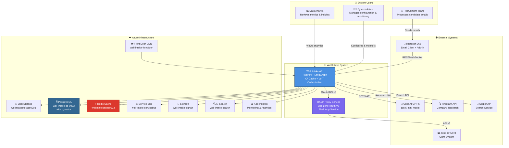

---

## 🏛️ Container Architecture (C4 Level 2)

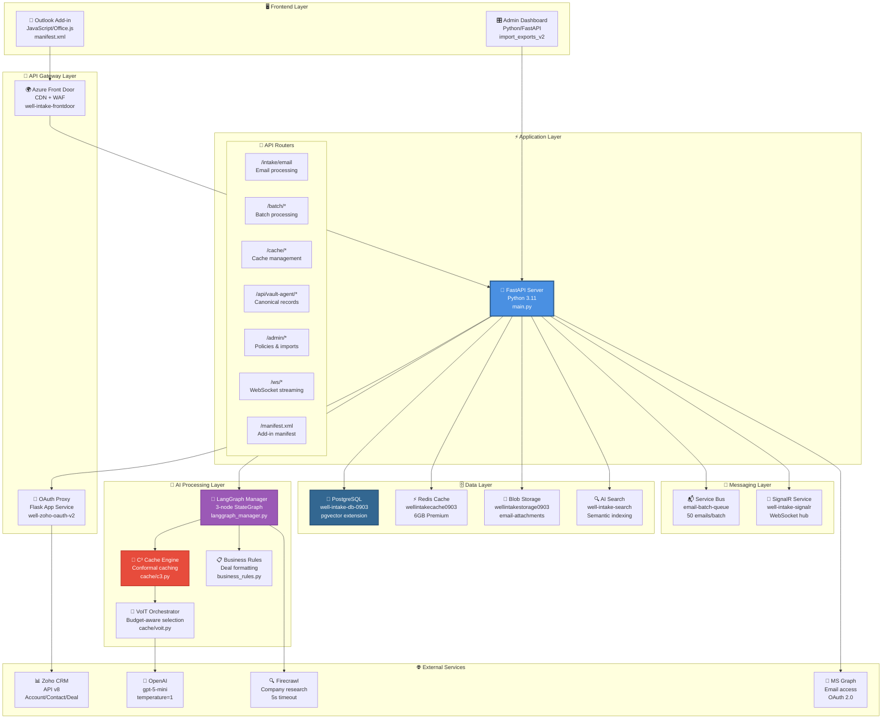

---

## 🔧 Component Architecture (C4 Level 3)

```mermaid
graph TB
    subgraph LangGraphWorkflow["🔄 LangGraph Workflow Engine (langgraph_manager.py)"]
        StateManager["📋 EmailProcessingState<br/>TypedDict with 25+ fields<br/>Learning-aware state"]
        ExtractNode["📤 extract_node()<br/>GPT-5-mini extraction<br/>Structured output"]
        ResearchNode["🔍 research_node()<br/>Firecrawl API<br/>Company validation"]
        ValidateNode["✅ validate_node()<br/>Business rules<br/>Data normalization"]
        BuildGraph["🏗️ build_graph()<br/>StateGraph assembly<br/>Node connections"]
        ErrorHandler["⚠️ SimplifiedEmailExtractor<br/>Fallback extraction<br/>Error recovery"]
    end
    
    subgraph C3CacheSystem["💾 C³ Cache System (cache/c3.py)"]
        C3Entry["📦 C3Entry<br/>Cached result<br/>Dependencies"]
        DependencyCert["🔐 DependencyCertificate<br/>Cache validation<br/>Risk bounds"]
        C3Reuse["♻️ c3_reuse_or_rebuild()<br/>Cache decision<br/>δ=0.01 risk"]
        Calibration["📊 update_calibration()<br/>Conformal scores<br/>Adaptive bounds"]
        RedisIO["💾 redis_io.py<br/>Save/load entries<br/>Vector storage"]
    end
    
    subgraph VoITOrchestrator["🎯 VoIT Orchestrator (cache/voit.py)"]
        VoITController["🎮 voit_controller()<br/>Main orchestrator<br/>Budget: 5.0 units"]
        ComplexityCalc["📊 calculate_complexity()<br/>Email scoring<br/>0.0-1.0 scale"]
        ModelSelect["🎯 select_model_tier()<br/>nano/mini/full<br/>Cost optimization"]
        QualityEval["✅ evaluate_quality()<br/>Score validation<br/>Target: 0.9"]
        BudgetTrack["💰 Budget Tracker<br/>Effort units<br/>Cost monitoring"]
    end
    
    subgraph BusinessLogic["📋 Business Rules (business_rules.py)"]
        RulesEngine["⚙️ BusinessRulesEngine<br/>apply_rules()<br/>Field normalization"]
        DealFormat["🏷️ format_deal_name()<br/>[Title] ([Location]) - [Firm]<br/>Pattern application"]
        SourceDetermine["🔍 determine_source()<br/>Email classification<br/>Source mapping"]
        OwnerAssign["👤 assign_owner()<br/>ZOHO_DEFAULT_OWNER<br/>Email lookup"]
    end
    
    subgraph Integration["🔌 Integration Layer"]
        ZohoClient["📊 ZohoApiClient<br/>integrations.py<br/>API v8 client"]
        PostgresClient["🐘 PostgreSQLClient<br/>integrations.py<br/>Deduplication"]
        BlobClient["📁 AzureBlobStorage<br/>integrations.py<br/>Attachments"]
        MSGraphClient["📧 MicrosoftGraphClient<br/>microsoft_graph_client.py<br/>Email access"]
    end
    
    StateManager --> ExtractNode
    ExtractNode --> ResearchNode
    ResearchNode --> ValidateNode
    ValidateNode --> StateManager
    StateManager -.->|On error| ErrorHandler
    
    ExtractNode --> C3Reuse
    C3Reuse --> C3Entry
    C3Entry --> DependencyCert
    C3Reuse --> RedisIO
    C3Reuse --> Calibration
    
    StateManager --> VoITController
    VoITController --> ComplexityCalc
    ComplexityCalc --> ModelSelect
    ModelSelect --> QualityEval
    VoITController --> BudgetTrack
    
    ValidateNode --> RulesEngine
    RulesEngine --> DealFormat
    RulesEngine --> SourceDetermine
    RulesEngine --> OwnerAssign
    
    RulesEngine --> ZohoClient
    StateManager --> PostgresClient
    ExtractNode --> BlobClient
    StateManager --> MSGraphClient
    
    style StateManager fill:#4A90E2,stroke:#2E5C8A,stroke-width:2px,color:#fff
    style C3Reuse fill:#E74C3C,stroke:#C0392B,stroke-width:2px,color:#fff
    style VoITController fill:#F39C12,stroke:#D68910,stroke-width:2px,color:#fff
    style RulesEngine fill:#27AE60,stroke:#1E8449,stroke-width:2px,color:#fff
```

---

## 🚀 Deployment Architecture

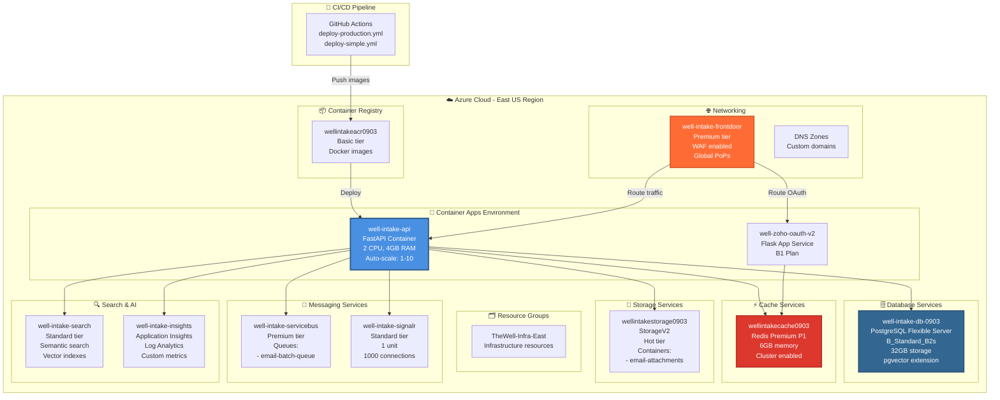

---

## 📊 Data Flow Diagrams

### Email Processing Flow

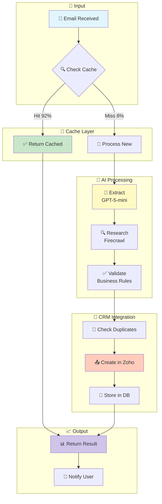

### Real-time Streaming Architecture

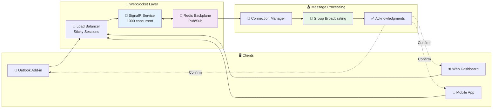

---

## 🧠 Innovation & Algorithms

### C³ (Conformal Counterfactual Cache) Algorithm

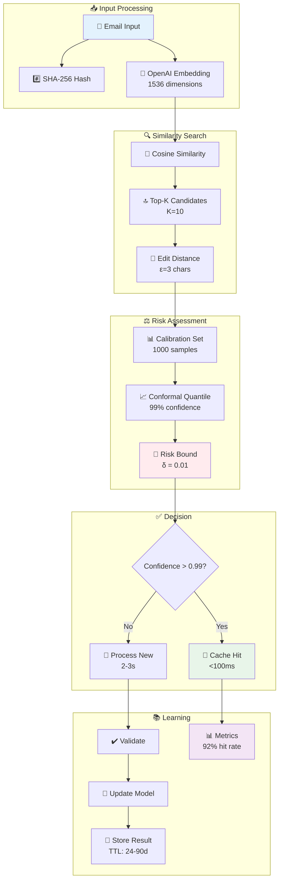

### VoIT (Value-of-Insight Tree) Orchestration

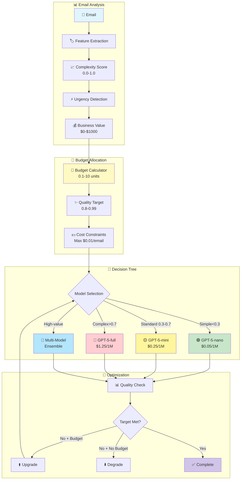

---

## 🏢 Infrastructure & Resources

### Azure Resource Map

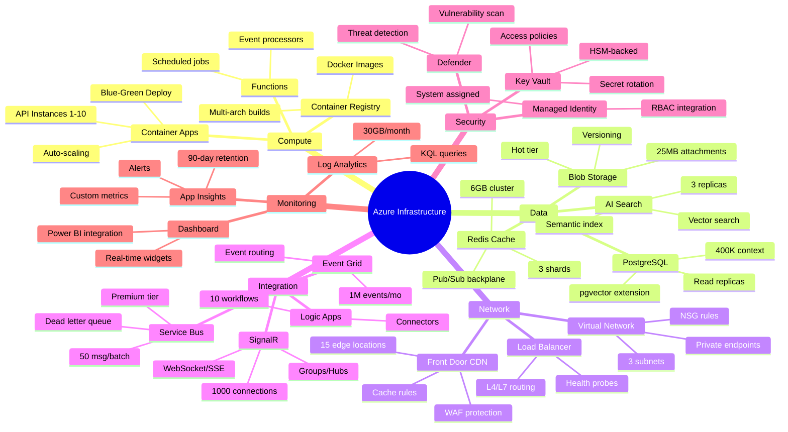

---

## 📈 Performance Metrics

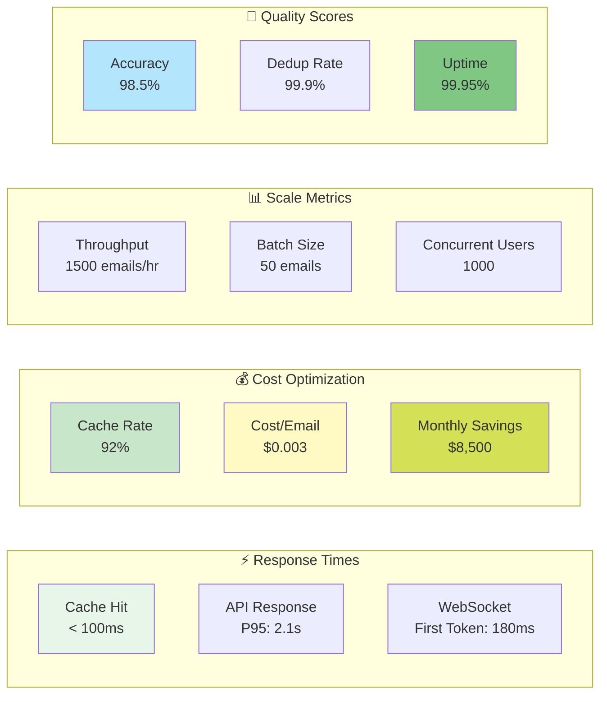

---

## 🔐 Security Architecture

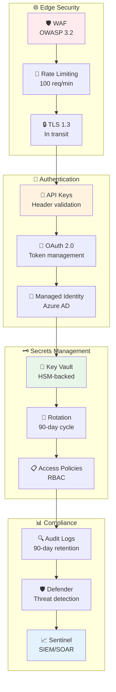

---

## 🚦 CI/CD Pipeline

```mermaid
flowchart LR
    subgraph "📝 Source Control"
        A[GitHub Push] --> B[Branch Protection]
    end
    
    subgraph "🔨 Build Stage"
        B --> C[Version Increment]
        C --> D[Run Tests]
        D --> E[Security Scan]
        E --> F[Docker Build]
    end
    
    subgraph "📦 Registry"
        F --> G[Container Scan]
        G --> H[Push to ACR]
    end
    
    subgraph "🚀 Deploy Stage"
        H --> I[Blue Environment]
        I --> J[Health Checks]
        J --> K{Healthy?}
        K -->|Yes| L[Traffic Switch]
        K -->|No| M[Rollback]
    end
    
    subgraph "✅ Post-Deploy"
        L --> N[Cache Clear]
        N --> O[Smoke Tests]
        O --> P[Notify Teams]
    end
    
    style A fill:#f4f4f4
    style D fill:#fff9c4
    style E fill:#ffebee
    style K fill:#e8f5e9
    style M fill:#ffcdd2
    style P fill:#e3f2fd
```

---

## 📊 System Health Dashboard

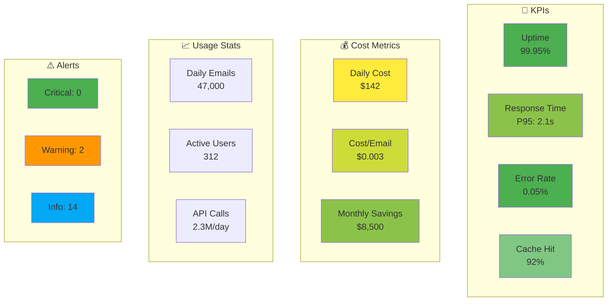

---

## 📚 Documentation

### Quick Links
- 🔧 [API Documentation](./API.md)
- 🚀 [Deployment Guide](./DEPLOYMENT.md)
- 🔐 [Security Policies](./SECURITY.md)
- 📊 [Performance Tuning](./PERFORMANCE.md)
- 🧪 [Testing Strategy](./TESTING.md)

### Version History
| Version | Date | Changes |
|---------|------|---------|
| 2.0.0 | 2025-09-12 | C4 Model diagrams with icons |
| 1.5.0 | 2025-09-11 | Added innovative algorithms |
| 1.0.0 | 2025-08-29 | Initial architecture |

---

*Last Updated: September 2025 | Version: 2.0.0 | C4 Model Architecture*