# Well Intake API - System Architecture

## 🏗️ High-Level Architecture


## 🔄 LangGraph Email Processing Workflow


## 🚀 Request Flow Sequence


## 🧠 Intelligent Features

### C³ (Conformal Counterfactual Cache)

```mermaid
graph TD
    INPUT[Email Input] --> EMBED[Generate Embedding]
    EMBED --> SIMILAR[Find Similar<br/>Cosine Distance]
    SIMILAR --> RISK[Risk Assessment<br/>δ = 0.01]
    RISK --> DECIDE{Risk < δ?}
    DECIDE -->|Yes| CACHE_HIT[Use Cached]
    DECIDE -->|No| PROCESS[Process New]
    PROCESS --> STORE[Store Result]
    
    style RISK fill:#FF5722
    style CACHE_HIT fill:#4CAF50
```


### VoIT (Value-of-Insight Tree)


## 📊 Data Models

### Email Processing State
```python
class EmailProcessingState(TypedDict):
    email_content: str
    sender_domain: str
    extraction_result: Optional[Dict]
    company_research: Optional[Dict]
    validation_result: Optional[Dict]
    final_output: Optional[ExtractedData]
    cache_key: Optional[str]
    model_tier: Literal["nano", "mini", "full"]
    processing_time_ms: float
    cost_estimate: float
```

### Extracted Data Schema
```python
class ExtractedData(BaseModel):
    # Candidate Information
    candidate_name: Optional[str]
    email: Optional[str]
    phone: Optional[str]
    linkedin_url: Optional[str]
    
    # Position Details
    job_title: Optional[str]
    location: Optional[str]
    company_name: Optional[str]
    industry: Optional[str]
    
    # Referral Information
    referrer_name: Optional[str]
    referrer_email: Optional[str]
    source: Optional[str]
    source_detail: Optional[str]
    
    # Additional Context
    notes: Optional[str]
    website: Optional[str]
```

## 🔐 Security Architecture


## 🎯 Performance Metrics

| Component | Metric | Target | Current |
|-----------|--------|--------|---------|
| **API Response** | P95 Latency | < 3s | 2.1s |
| **Cache Hit Rate** | Success % | > 80% | 92% |
| **LangGraph Pipeline** | Processing Time | < 3s | 2-3s |
| **GPT-5 Calls** | Cost per Email | < $0.01 | $0.003 |
| **Batch Processing** | Emails/Hour | > 1000 | 1500 |
| **WebSocket** | First Token | < 200ms | 180ms |
| **Database** | Query Time | < 100ms | 45ms |
| **Blob Storage** | Upload Time | < 500ms | 320ms |

## 🚦 Deployment Pipeline


## 📈 Scaling Strategy

### Horizontal Scaling
- **Container Apps**: 1-10 replicas based on CPU/Memory
- **Redis Cache**: 6GB with clustering support
- **PostgreSQL**: Read replicas for query distribution
- **Service Bus**: Partitioned queues for parallel processing

### Vertical Scaling
- **GPT-5 Tiers**: Dynamic model selection based on complexity
- **Batch Size**: 1-50 emails per context window
- **Cache TTL**: 24hr-90day based on pattern stability
- **Context Window**: Up to 400K tokens with pgvector

## 🔧 Technology Stack

| Layer | Technology | Purpose |
|-------|------------|---------|
| **Frontend** | Office.js, JavaScript | Outlook integration |
| **CDN** | Azure Front Door | Global distribution |
| **API** | FastAPI, Python 3.11 | REST & WebSocket APIs |
| **Workflow** | LangGraph 0.2.74 | Orchestration pipeline |
| **AI** | GPT-5 (nano/mini/full) | Text extraction |
| **Cache** | Azure Redis 6.0 | Response caching |
| **Database** | PostgreSQL 15 + pgvector | Data persistence |
| **Queue** | Azure Service Bus | Batch processing |
| **Storage** | Azure Blob Storage | File attachments |
| **Search** | Azure AI Search | Semantic indexing |
| **Monitoring** | Application Insights | Telemetry & metrics |
| **Security** | Azure Key Vault | Secret management |
| **Container** | Docker, Container Apps | Deployment platform |

## 🌍 Environment Configuration

```bash
# Core Services
API_KEY=<secure-api-key>
DATABASE_URL=postgresql://...@.postgres.database.azure.com:5432/wellintake
AZURE_REDIS_CONNECTION_STRING=rediss://...@.redis.cache.windows.net:6380

# AI Configuration
OPENAI_API_KEY=sk-proj-...
OPENAI_MODEL=gpt-5-mini
USE_LANGGRAPH=true

# Feature Flags
FEATURE_C3=true         # Conformal cache
FEATURE_VOIT=true       # Budget orchestration
C3_DELTA=0.01          # 1% risk tolerance
VOIT_BUDGET=5.0        # Processing units

# Integration
ZOHO_OAUTH_SERVICE_URL=https://well-zoho-oauth.azurewebsites.net
FIRECRAWL_API_KEY=fc-...
```

## 📞 API Endpoints

### Core Endpoints
- `POST /intake/email` - Process single email
- `POST /intake/batch` - Process multiple emails
- `GET /health` - Health check
- `GET /cache/status` - Cache metrics

### WebSocket Endpoints
- `WS /ws/process` - Real-time processing
- `WS /ws/status` - Live status updates

### Admin Endpoints
- `POST /cache/invalidate` - Clear cache
- `POST /cache/warmup` - Preload patterns
- `GET /metrics` - Performance metrics

### Manifest Endpoints
- `GET /manifest.xml` - Outlook add-in manifest
- `GET /cdn/status` - CDN configuration
- `POST /cdn/purge` - Purge CDN cache

## 🔍 Monitoring & Observability


---

*Last Updated: September 2025 | Version: 1.4.0*