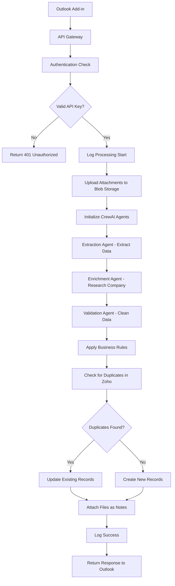
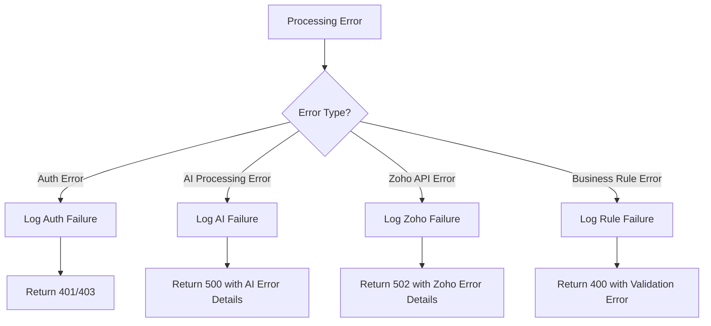

# Product Requirements Document: Well Intake API - Automated Email Processing System

| | |
| :--- | :--- |
| **Document Title** | Technical Specification for `well-intake-api` |
| **Version** | 2.1 |
| **Date** | August 22, 2025 |
| **Objective** | Serve as the single source of truth for all AI subagents building this application. |

---

## Executive Summary

The `well-intake-api` is an intelligent email processing system that automates the creation of CRM records in Zoho from unstructured emails. Built as a Python FastAPI application hosted on Azure, it serves as the backend for an Outlook Add-in that enables users to seamlessly convert recruitment emails into structured CRM data.

### Key Value Propositions:
- **Automated Data Entry**: Eliminates manual CRM data entry from recruitment emails
- **AI-Powered Intelligence**: Uses GPT-5 mini with CrewAI orchestration for accurate data extraction
- **Business Rule Enforcement**: Applies consistent formatting and validation rules
- **Duplicate Prevention**: Prevents creation of duplicate records in Zoho CRM
- **Scalable Architecture**: Built on Azure cloud infrastructure for enterprise scalability

### Target Users:
- Recruitment professionals using Outlook and Zoho CRM
- HR teams managing candidate intake processes
- Business development teams processing inbound leads

## 1. High-Level Objective
The system, `well-intake-api`, will be a Python FastAPI application hosted on Azure. It will serve as the backend for an Outlook Add-in, automating the creation of CRM records in Zoho from emails. The system must use AI to intelligently interpret unstructured emails, apply a strict set of business rules, and ensure data consistency within Zoho CRM.

---

## 2. System Architecture & Technical Stack
| Component | Technology / Resource Name | Purpose & Integration Point |
| :--- | :--- | :--- |
| **Compute** | **New** Azure App Service (Linux) | Host the FastAPI application (`well-intake-api`) in `TheWell-App-East` resource group. |
| **Database** | Azure Cosmos DB for PostgreSQL (`well-intake-db`) | Backend for V2 AI learning. The application should be coded to be compatible with a PostgreSQL DB using SQLAlchemy and pgvector. |
| **Storage** | Azure Blob Storage (`wellintakeattachments`) | Store all email attachments in the `email-attachments` container. |
| **Authentication** | Azure App Service (`well-zoho-oauth`) | The application **must** integrate with `https://well-zoho-oauth.azurewebsites.net` for all Zoho API OAuth2 token management. |
| **AI Orchestration** | **CrewAI** (Python Library) | Manage a crew of specialized AI agents for processing tasks. |
| **AI Model** | **GPT-5 mini** | The large language model powering all CrewAI agents. |
| **Web Research Tool** | **Firecrawl API** | The primary tool for the Enrichment Agent to validate company information. |
| **Monitoring** | Log Analytics (`workspace-heellnfraastTQf8`) | All application logs must be configured to stream to this workspace. |

---

## 3. End-to-End Workflow Sequence
The application's core `/intake/email` endpoint must follow this sequence:
1.  **Ingest & Authenticate:** Receive JSON payload from Outlook Add-in and validate the API key.
2.  **Process Attachments:** If present, upload to Azure Blob Storage and store the resulting URLs.
3.  **Run CrewAI:** Execute the AI crew to extract and enrich data from the email body.
4.  **Apply Business Logic:** Process the AI's output through the Business Rules Engine to format names, determine sources, and construct the final deal name.
5.  **Prevent Duplicates:** Query Zoho API to check for existing Contacts (by email) and Accounts (by name).
6.  **Execute Zoho Operations:** In order: Get Auth Token, Upsert Account, Upsert Contact, Create Deal, Attach Files (as notes).
7.  **Respond to Client:** Return a `200 OK` JSON response with a success message and relevant Zoho IDs.

---

## 4. Core Business Logic Engine Specification
The system must contain functions to enforce these rules:

*   **`format_deal_name(job_title, location, company_name)`:**
    *   **Returns:** A string formatted as: `"[Job Title] ([Location]) - [Firm Name]"`.
    *   **Logic:** Use "Unknown" as a placeholder for any null/empty input.

*   **`clean_contact_name(name)`:**
    *   **Logic:** Remove honorifics (Mr., Mrs., etc.) and split the name into first/last name parts.

*   **`determine_source(email_body, referrer_name)`:**
    *   **Logic (Prioritized):**
        1.  If `referrer_name` is present, return `("Referral", referrer_name)`.
        2.  If text contains "TWAV" or "Advisor Vault", return `("Reverse Recruiting", "TWAV Platform")`.
        3.  If text contains a "Calendly" link, return `("Website Inbound", "Calendly scheduling")`.

*   **`identify_company(email_body, sender_domain)`:**
    *   **Logic (Prioritized):**
        1.  **Explicit Mention:** Search for a company name in the email body or signature.
        2.  **Web Research:** If no explicit name is found, use the **Firecrawl tool** with the `sender_domain` to find the official company name.
        3.  **Domain Fallback:** If Firecrawl fails, infer a placeholder name from the domain.

---

## 5. AI Agent Crew Specification
*   **Framework:** CrewAI, Sequential Process, LLM: `GPT-5 mini`
*   **Agent 1: Extraction Agent (`Reader`)**: Extracts `candidate_name`, `job_title_context`, `location_context`, `company_name_guess`, `referrer_name`.
*   **Agent 2: Enrichment Agent (`Researcher`)**: Validates `company_name` using the Firecrawl tool and the `identify_company` logic.
*   **Agent 3: Validation Agent (`Validator`)**: Cleans and standardizes the final JSON object.

---

## 6. Zoho API Integration & Field Mapping
*   **API Version:** v6
*   **Authentication:** via `well-zoho-oauth` service
*   **Key Field Mappings:**
    *   `Deal_Name`: From Business Rules Engine
    *   `Owner`: Hardcoded to Steve Perry's ID
    *   `Source`: From Business Rules Engine
    *   `Source_Detail`: Referrer's name from AI
    *   `Description`: AI-generated summary

---

## 7. Data Models

### 7.1 Core Data Structures

#### EmailProcessingRequest
```python
class EmailProcessingRequest(BaseModel):
    sender_email: str
    sender_name: str
    subject: str
    body: str
    attachment_urls: Optional[List[str]] = None
    received_datetime: datetime
    outlook_message_id: str
```

#### ExtractedData
```python
class ExtractedData(BaseModel):
    candidate_name: str
    job_title_context: Optional[str]
    location_context: Optional[str]
    company_name_guess: Optional[str]
    referrer_name: Optional[str]
    summary: str
```

#### ZohoRecords
```python
class ZohoContact(BaseModel):
    first_name: str
    last_name: str
    email: str
    phone: Optional[str]
    lead_source: str
    lead_source_detail: Optional[str]

class ZohoAccount(BaseModel):
    account_name: str
    website: Optional[str]
    industry: Optional[str]
    account_type: str = "Prospect"

class ZohoDeal(BaseModel):
    deal_name: str
    account_name: str
    contact_name: str
    stage: str = "Qualification"
    amount: Optional[float]
    source: str
    source_detail: Optional[str]
    description: str
    owner: str  # Steve Perry's ID
```

### 7.2 Database Schema (PostgreSQL)

#### email_processing_log
```sql
CREATE TABLE email_processing_log (
    id SERIAL PRIMARY KEY,
    outlook_message_id VARCHAR(255) UNIQUE NOT NULL,
    sender_email VARCHAR(255) NOT NULL,
    processing_status VARCHAR(50) NOT NULL,
    zoho_contact_id VARCHAR(50),
    zoho_account_id VARCHAR(50),
    zoho_deal_id VARCHAR(50),
    created_at TIMESTAMP DEFAULT CURRENT_TIMESTAMP,
    updated_at TIMESTAMP DEFAULT CURRENT_TIMESTAMP,
    error_message TEXT,
    extracted_data JSONB,
    ai_confidence_score FLOAT
);
```

#### attachment_log
```sql
CREATE TABLE attachment_log (
    id SERIAL PRIMARY KEY,
    email_log_id INTEGER REFERENCES email_processing_log(id),
    original_filename VARCHAR(255) NOT NULL,
    blob_storage_url VARCHAR(500) NOT NULL,
    file_size_bytes INTEGER,
    content_type VARCHAR(100),
    uploaded_at TIMESTAMP DEFAULT CURRENT_TIMESTAMP
);
```

---

## 8. API Endpoints

### 8.1 Core Endpoints

#### POST /intake/email
**Purpose**: Main endpoint for processing emails from Outlook Add-in

**Request Headers**:
```
Content-Type: application/json
X-API-Key: {api_key}
```

**Request Body**:
```json
{
  "sender_email": "john.doe@company.com",
  "sender_name": "John Doe",
  "subject": "Software Engineer Position",
  "body": "I am interested in the software engineer position...",
  "attachment_urls": ["https://attachment1.url", "https://attachment2.url"],
  "received_datetime": "2025-08-22T10:30:00Z",
  "outlook_message_id": "outlook_msg_12345"
}
```

**Response (Success)**:
```json
{
  "status": "success",
  "message": "Email processed successfully",
  "zoho_records": {
    "contact_id": "contact_12345",
    "account_id": "account_67890",
    "deal_id": "deal_11111"
  },
  "processing_details": {
    "extracted_data": {...},
    "business_rules_applied": [...],
    "duplicates_found": false
  }
}
```

#### GET /health
**Purpose**: Health check endpoint for monitoring

**Response**:
```json
{
  "status": "healthy",
  "timestamp": "2025-08-22T10:30:00Z",
  "services": {
    "database": "connected",
    "zoho_oauth": "connected",
    "blob_storage": "connected"
  }
}
```

#### GET /status/{outlook_message_id}
**Purpose**: Check processing status of a specific email

**Response**:
```json
{
  "outlook_message_id": "outlook_msg_12345",
  "status": "completed",
  "created_at": "2025-08-22T10:30:00Z",
  "zoho_records": {...}
}
```

### 8.2 Administrative Endpoints

#### GET /logs
**Purpose**: Retrieve processing logs (admin access only)

**Query Parameters**:
- `limit`: Number of records (default: 50)
- `status`: Filter by processing status
- `from_date`: Start date filter
- `to_date`: End date filter

#### POST /reprocess/{outlook_message_id}
**Purpose**: Reprocess a failed email

---

## 9. Email Processing Workflow

### 9.1 Detailed Processing Flow



### 9.2 Error Handling Workflow



### 9.3 Retry Logic

- **Zoho API Failures**: Retry up to 3 times with exponential backoff
- **Blob Storage Failures**: Retry up to 2 times with 5-second delay
- **AI Processing Failures**: Single attempt (no retry to avoid cost accumulation)

---

## 10. Business Rules Engine

### 10.1 Core Business Rules Functions

#### format_deal_name(job_title, location, company_name)
```python
def format_deal_name(job_title: str, location: str, company_name: str) -> str:
    """
    Formats deal name according to business rules.
    Returns: "[Job Title] ([Location]) - [Firm Name]"
    Uses "Unknown" as placeholder for null/empty inputs.
    """
    job_title = job_title or "Unknown Position"
    location = location or "Unknown Location"
    company_name = company_name or "Unknown Company"
    
    return f"{job_title} ({location}) - {company_name}"
```

#### clean_contact_name(name)
```python
def clean_contact_name(name: str) -> Tuple[str, str]:
    """
    Removes honorifics and splits name into first/last parts.
    Returns: (first_name, last_name)
    """
    honorifics = ['mr.', 'mrs.', 'ms.', 'dr.', 'prof.', 'sir', 'madam']
    name_parts = name.lower().split()
    
    # Remove honorifics
    cleaned_parts = [part for part in name_parts 
                    if part.rstrip('.,') not in honorifics]
    
    if len(cleaned_parts) >= 2:
        return cleaned_parts[0].title(), ' '.join(cleaned_parts[1:]).title()
    elif len(cleaned_parts) == 1:
        return cleaned_parts[0].title(), ""
    else:
        return "Unknown", "Contact"
```

#### determine_source(email_body, referrer_name)
```python
def determine_source(email_body: str, referrer_name: str = None) -> Tuple[str, str]:
    """
    Determines lead source based on priority rules.
    Returns: (source_type, source_detail)
    """
    if referrer_name:
        return ("Referral", referrer_name)
    
    email_body_lower = email_body.lower()
    
    if "twav" in email_body_lower or "advisor vault" in email_body_lower:
        return ("Reverse Recruiting", "TWAV Platform")
    
    if "calendly" in email_body_lower:
        return ("Website Inbound", "Calendly scheduling")
    
    return ("Email Inbound", "Direct email contact")
```

#### identify_company(email_body, sender_domain)
```python
def identify_company(email_body: str, sender_domain: str) -> str:
    """
    Identifies company name using prioritized logic.
    Returns: company_name
    """
    # 1. Search for explicit company mention in email
    company_patterns = [
        r"from\s+([A-Z][A-Za-z\s&]+(?:Inc|LLC|Corp|Ltd))",
        r"at\s+([A-Z][A-Za-z\s&]+(?:Inc|LLC|Corp|Ltd))",
        r"with\s+([A-Z][A-Za-z\s&]+(?:Inc|LLC|Corp|Ltd))"
    ]
    
    for pattern in company_patterns:
        match = re.search(pattern, email_body)
        if match:
            return match.group(1).strip()
    
    # 2. Use Firecrawl for web research
    try:
        company_name = firecrawl_research_company(sender_domain)
        if company_name:
            return company_name
    except Exception as e:
        logger.warning(f"Firecrawl research failed: {e}")
    
    # 3. Domain fallback
    domain_parts = sender_domain.split('.')
    if len(domain_parts) >= 2:
        return domain_parts[-2].title() + " (inferred from domain)"
    
    return "Unknown Company"
```

### 10.2 Validation Rules

- **Email Addresses**: Must be valid format and not in blocklist
- **Phone Numbers**: Standardize to E.164 format when possible
- **Company Names**: Remove common suffixes for deduplication
- **Deal Amounts**: Must be positive numbers if provided
- **Dates**: Must be valid ISO format

---

## 11. Outlook Add-in Integration

### 11.1 Add-in Architecture

The Outlook Add-in consists of:
- **Manifest.xml**: Defines add-in capabilities and permissions
- **TaskPane HTML**: User interface for email processing
- **JavaScript Commands**: Handles email data extraction and API communication

### 11.2 Manifest.xml Specifications

```xml
<?xml version="1.0" encoding="UTF-8" standalone="yes"?>
<OfficeApp xmlns="http://schemas.microsoft.com/office/appforoffice/1.1" 
           xmlns:xsi="http://www.w3.org/2001/XMLSchema-instance" 
           xmlns:bt="http://schemas.microsoft.com/office/officeappbasictypes/1.0" 
           xmlns:mailappor="http://schemas.microsoft.com/office/mailappversionoverrides/1.0" 
           xsi:type="MailApp">
  
  <Id>a1b2c3d4-e5f6-7890-abcd-ef1234567890</Id>
  <Version>1.0.0.0</Version>
  <ProviderName>The Well</ProviderName>
  <DefaultLocale>en-US</DefaultLocale>
  <DisplayName DefaultValue="Well Intake Assistant"/>
  <Description DefaultValue="Automate CRM record creation from recruitment emails"/>
  <IconUrl DefaultValue="https://your-cdn.com/icon-64.png"/>
  <HighResolutionIconUrl DefaultValue="https://your-cdn.com/icon-128.png"/>
  
  <Hosts>
    <Host Name="Mailbox"/>
  </Hosts>
  
  <Requirements>
    <Sets>
      <Set Name="Mailbox" MinVersion="1.5"/>
    </Sets>
  </Requirements>
  
  <FormSettings>
    <Form xsi:type="ItemRead">
      <DesktopSettings>
        <SourceLocation DefaultValue="https://your-addin-host.com/taskpane.html"/>
        <RequestedHeight>450</RequestedHeight>
      </DesktopSettings>
    </Form>
  </FormSettings>
  
  <Permissions>ReadWriteItem</Permissions>
  
  <Rule xsi:type="RuleCollection" Mode="Or">
    <Rule xsi:type="ItemIs" ItemType="Message" FormType="Read"/>
  </Rule>
</OfficeApp>
```

### 11.3 JavaScript API Integration

```javascript
// Extract email data and send to API
async function processEmail() {
    try {
        Office.context.mailbox.item.loadCustomPropertiesAsync((result) => {
            if (result.status === Office.AsyncResultStatus.Succeeded) {
                const emailData = {
                    sender_email: Office.context.mailbox.item.sender.emailAddress,
                    sender_name: Office.context.mailbox.item.sender.displayName,
                    subject: Office.context.mailbox.item.subject,
                    body: Office.context.mailbox.item.body.getAsync('text'),
                    received_datetime: Office.context.mailbox.item.dateTimeCreated.toISOString(),
                    outlook_message_id: Office.context.mailbox.item.itemId
                };
                
                sendToWellIntakeAPI(emailData);
            }
        });
    } catch (error) {
        console.error('Error processing email:', error);
        showNotification('Error', 'Failed to process email');
    }
}

async function sendToWellIntakeAPI(emailData) {
    const response = await fetch('https://well-intake-api.azurewebsites.net/intake/email', {
        method: 'POST',
        headers: {
            'Content-Type': 'application/json',
            'X-API-Key': 'your-api-key-here'
        },
        body: JSON.stringify(emailData)
    });
    
    const result = await response.json();
    
    if (response.ok) {
        showNotification('Success', 'CRM records created successfully');
    } else {
        showNotification('Error', result.message || 'Processing failed');
    }
}
```

---

## 12. Security Considerations

### 12.1 Authentication & Authorization

- **API Key Authentication**: All API requests require valid API key in header
- **Azure AD Integration**: Future enhancement for enterprise SSO
- **Zoho OAuth Integration**: Secure token management via `well-zoho-oauth` service
- **Role-Based Access**: Admin vs. user permissions for different endpoints

### 12.2 Data Protection

- **Encryption in Transit**: All API communications use HTTPS/TLS 1.3
- **Encryption at Rest**: Azure Blob Storage and Cosmos DB encryption enabled
- **Data Retention**: Email content purged after 90 days, metadata retained for 1 year
- **PII Handling**: Candidate personal information encrypted and access-logged

### 12.3 Security Monitoring

- **Request Logging**: All API requests logged with IP, timestamp, and user agent
- **Rate Limiting**: 100 requests per minute per API key
- **Anomaly Detection**: Unusual usage patterns trigger alerts
- **Security Headers**: CORS, CSP, and security headers properly configured

### 12.4 Compliance

- **GDPR Compliance**: Data subject rights implementation (access, deletion, portability)
- **SOC 2 Type II**: Azure infrastructure compliance inherited
- **Data Processing Agreements**: Clear terms for AI model data usage

---

## 13. Deployment Strategy

### 13.1 Azure Infrastructure

#### Resource Group: TheWell-App-East
- **Location**: East US
- **Subscription**: Production subscription
- **Tags**: Environment=prod, Application=well-intake-api, Owner=development-team

#### Compute Resources
```yaml
App Service Plan:
  name: well-intake-plan
  sku: P2v3  # 2 cores, 7GB RAM
  operating_system: Linux
  
App Service:
  name: well-intake-api
  runtime: Python 3.11
  always_on: true
  https_only: true
  client_affinity: false
```

#### Database Configuration
```yaml
Cosmos DB for PostgreSQL:
  name: well-intake-db
  compute_units: 2 vCores
  storage: 32 GB
  high_availability: enabled
  backup_retention: 35 days
  point_in_time_restore: enabled
```

#### Storage Configuration
```yaml
Blob Storage Account:
  name: wellintakeattachments
  tier: Standard_LRS
  containers:
    - email-attachments (private access)
  lifecycle_policy: delete_after_1_year
```

### 13.2 CI/CD Pipeline

#### GitHub Actions Workflow
```yaml
name: Deploy Well Intake API

on:
  push:
    branches: [main]
  pull_request:
    branches: [main]

jobs:
  test:
    runs-on: ubuntu-latest
    steps:
      - uses: actions/checkout@v3
      - name: Set up Python
        uses: actions/setup-python@v3
        with:
          python-version: '3.11'
      - name: Install dependencies
        run: |
          pip install -r requirements.txt
          pip install pytest pytest-cov
      - name: Run tests
        run: pytest --cov=app tests/
      
  deploy:
    needs: test
    runs-on: ubuntu-latest
    if: github.ref == 'refs/heads/main'
    steps:
      - uses: actions/checkout@v3
      - name: Deploy to Azure Web App
        uses: azure/webapps-deploy@v2
        with:
          app-name: well-intake-api
          publish-profile: ${{ secrets.AZURE_WEBAPP_PUBLISH_PROFILE }}
```

### 13.3 Environment Configuration

#### Production Environment Variables
```bash
# API Configuration
API_KEY=prod_api_key_here
ENVIRONMENT=production
LOG_LEVEL=INFO

# Azure Services
AZURE_BLOB_CONNECTION_STRING=DefaultEndpointsProtocol=https;...
AZURE_COSMOS_CONNECTION_STRING=postgresql://...

# AI Services
OPENAI_API_KEY=sk-...
FIRECRAWL_API_KEY=fc-...

# Zoho Integration
ZOHO_OAUTH_SERVICE_URL=https://well-zoho-oauth.azurewebsites.net

# Monitoring
LOG_ANALYTICS_WORKSPACE_ID=workspace-id-here
APPLICATION_INSIGHTS_KEY=ai-key-here
```

### 13.4 Scaling Strategy

- **Horizontal Scaling**: Auto-scale rules based on CPU and memory usage
- **Database Scaling**: Vertical scaling for Cosmos DB as needed
- **Storage Scaling**: Automatic scaling for Blob Storage
- **Global Distribution**: Deploy to additional regions if international usage grows

---

## 14. Success Metrics

### 14.1 Performance Metrics

#### Primary KPIs
- **Processing Success Rate**: Target 98% successful email processing
- **Response Time**: 95th percentile under 30 seconds for email processing
- **API Availability**: 99.9% uptime SLA
- **Data Accuracy**: 95% accuracy rate for extracted company names and job titles

#### Secondary KPIs
- **Duplicate Prevention Rate**: 99% success in preventing duplicate records
- **User Adoption**: 80% of target users actively using the add-in monthly
- **Processing Volume**: Handle 1000+ emails per day
- **Error Recovery**: 90% of failed processes recoverable through retry

### 14.2 Business Impact Metrics

- **Time Savings**: 5 minutes saved per email processed (target 2000+ emails/month)
- **Data Quality Improvement**: 40% reduction in CRM data inconsistencies
- **User Satisfaction**: 4.5/5 average rating in user feedback
- **ROI**: Positive return on investment within 6 months

### 14.3 Monitoring & Alerting

#### Application Monitoring
```yaml
Alerts:
  - name: High Error Rate
    condition: error_rate > 5%
    severity: Critical
    
  - name: Slow Response Time
    condition: p95_response_time > 45s
    severity: Warning
    
  - name: API Downtime
    condition: availability < 99%
    severity: Critical
    
  - name: Database Connection Issues
    condition: db_connection_failures > 0
    severity: High
```

#### Business Logic Monitoring
```yaml
Custom Metrics:
  - emails_processed_total
  - zoho_records_created_total
  - ai_extraction_confidence_avg
  - duplicate_prevention_success_rate
  - attachment_upload_success_rate
```

### 14.4 Reporting Dashboard

#### Real-time Metrics
- Current processing queue length
- Success/failure rates (last 24 hours)
- Average processing time
- System health status

#### Historical Analytics
- Weekly/monthly processing volumes
- Trend analysis for accuracy rates
- User adoption metrics
- Cost analysis and optimization opportunities

---

## 15. File Manifest
*   `requirements.txt`
*   `.env.sample`
*   `app/main.py`
*   `app/models.py`
*   `app/integrations.py`
*   `app/business_rules.py`
*   `app/crewai_manager.py`
*   `addin/manifest.xml`
*   `addin/commands.js`
*   `tests/test_business_rules.py`
*   `tests/test_api_endpoints.py`
*   `tests/test_crewai_integration.py`
*   `docs/api_documentation.md`
*   `docs/deployment_guide.md`
*   `docker/Dockerfile`
*   `docker/docker-compose.yml`
*   `.github/workflows/deploy.yml`