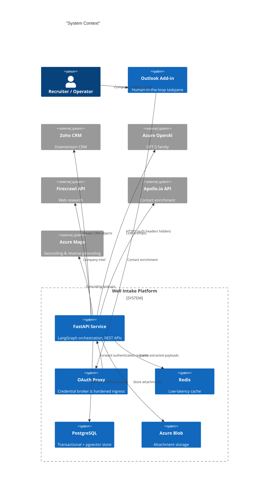
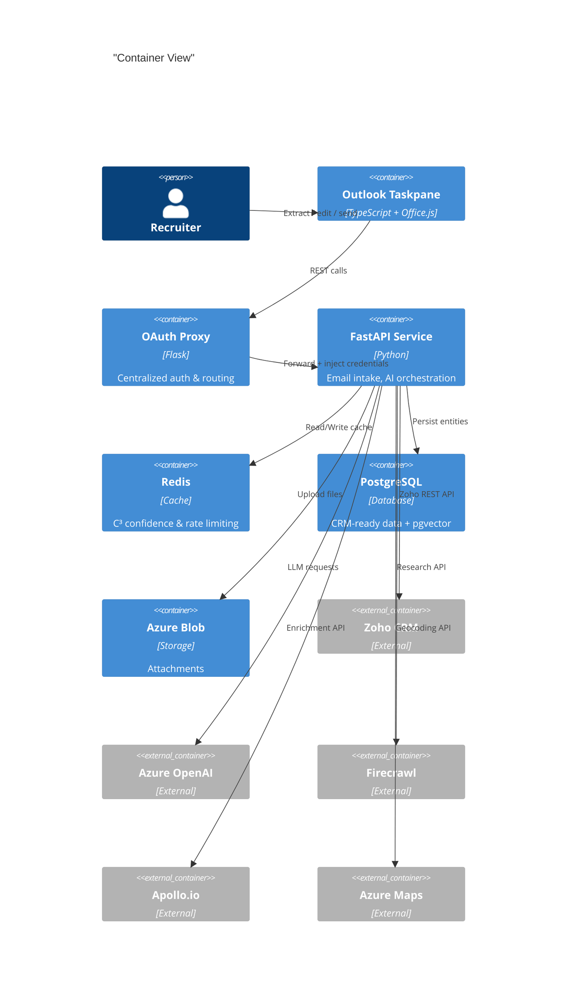
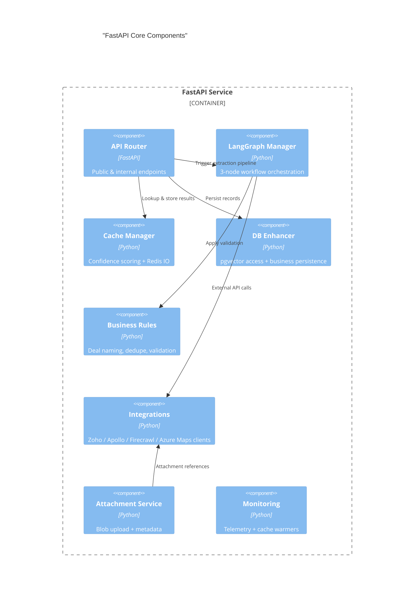

# Well Intake Platform

[](https://www.python.org/)
[](https://fastapi.tiangolo.com/)
[](https://azure.microsoft.com/)
[](https://redis.io/)
[](https://www.postgresql.org/)
[]()

> AI-assisted email intake that transforms Outlook messages into enriched Zoho CRM records in seconds.

---

## Contents

1. [Overview](#overview)
2. [Quick Start](#quick-start)
3. [Key Capabilities](#key-capabilities)
4. [Architecture](#architecture)
5. [Development Guide](#development-guide)
6. [Testing](#testing)
7. [CI/CD & Operations](#cicd--operations)
8. [Directory Layout](#directory-layout)
9. [Support](#support)

---

## Overview

Well Intake automates the journey from recruiting email to CRM record. The system combines FastAPI services, Outlook add-ins, Azure Container Apps, Redis caching, and LangGraph-based AI pipelines to extract, enrich, validate, and submit deal data into Zoho CRM. The platform focuses on:

- **Accuracy** – multi-stage extraction with enrichment (Firecrawl v2, Apollo.io) and duplicate detection.
- **Speed** – sub-3s processing through caching, async IO, and streamed workflows.
- **Operator Control** – human-in-the-loop Outlook taskpane with edit-before-send flows and preview/test modes.
- **Observability & Safety** – structured logging, health endpoints, cache warmers, and emergency rollback tooling.


## Quick Start

| Step | Command | Notes |
|------|---------|-------|
| 1 | `python -m venv .venv && source .venv/bin/activate` | Use Python 3.11 |
| 2 | `pip install -r requirements-dev.txt` | Installs FastAPI, LangGraph, tooling |
| 3 | `npm install --prefix addin` | Installs Outlook add-in dependencies |
| 4 | `cp app/.env.local.example app/.env.local` | Fill in secrets & API keys |
| 5 | `uvicorn app.main:app --reload` | Starts API locally |
| 6 | `npm run dev --prefix addin` | Runs add-in dev server |

Make sure Redis and PostgreSQL are available (see [Development Guide](#development-guide) for container helpers).


## Key Capabilities

### Intake & Enrichment
- Multi-stage LangGraph pipeline (extract → research → validate) powered by GPT-5 tiers.
- Firecrawl v2 “supercharged” enrichment with company HQ, revenue, funding, tech stack, and leadership insights.
- Apollo.io enrichment for contact-level details (phone, LinkedIn, titles) with smart throttling.

### Outlook Taskpane Experience
- One-click **Send to Zoho**, **Test**, and enrichment controls inside Outlook.
- Real-time field confidence indicators, attachment previews, and manual override hints.
- Express-send gating based on extraction confidence and deduplication checks.

### CRM Automation
- Creates or updates Zoho Accounts, Contacts, and Deals with full enrichment data.
- Duplicate guardrails (email / company / time-window) prevent accidental reconciling.
- Attachment ingestion into Azure Blob storage with metadata hydration.

### Platform Services
- Redis-backed caching with auto-invalidation during deployments.
- Azure Container Apps hosting with GitHub Actions pipeline (version bumping + cache busting).
- Emergency rollback workflow for instant traffic shift to previous revisions.

### Geocoding & Location Intelligence
- Optional Azure Maps integration for forward/reverse geocoding.
- Automated address normalization and city/state enrichment during company research.
- Configurable country bias, caching (24h TTL), and feature flag via `ENABLE_AZURE_MAPS`.


## Architecture

### System Context (C4 Level 1)



### Container View (C4 Level 2)



### Component View (C4 Level 3 – FastAPI Core)




## Development Guide

### Environment
- Python 3.11+
- Node.js 18+ for the add-in
- Redis 6.x (local container recommended)
- PostgreSQL 15 with `pgvector` extension

Use the provided helper scripts:

```bash
# Launch local infra with Docker Compose (Redis + PostgreSQL)
./scripts/startup.sh

# Seed sample data / fixtures
python app/admin/seed_policies.py
```

### Configuration

`app/.env.local.example` documents the required variables. Key items:

- `OPENAI_API_KEY` / `AZURE_OPENAI_ENDPOINT`
- `ZOHO_CLIENT_ID`, `ZOHO_CLIENT_SECRET`, `ZOHO_REFRESH_TOKEN`
- `FIRECRAWL_API_KEY`, `APOLLO_API_KEY`
- `REDIS_URL`, `DATABASE_URL`
- Optional geocoding: `ENABLE_AZURE_MAPS`, `AZURE_MAPS_KEY` (or Key Vault secret), `AZURE_MAPS_DEFAULT_COUNTRY`

For the Outlook add-in, set `API_BASE_URL` and `API_KEY` in `addin/config.js` or `.env` depending on deployment target.

> Detailed geocoding setup lives in [`docs/geo/azure_maps.md`](docs/geo/azure_maps.md).

### Useful Commands

```bash
# Run FastAPI with autoreload
uvicorn app.main:app --reload --port 8000

# Run background batch pipeline
python run_all_tests.py --mode batch

# Start taskpane in development mode
npm run dev --prefix addin

# Lint add-in code
npm run lint --prefix addin
```


## Testing

- **Python unit/integration tests**: `pytest`
- **Selective suites**: `pytest tests/test_addin_endpoints.py`
- **Smoke test script**: `./run_tests.sh`
- **Front-end** (manual) – load the Outlook add-in with Office 365 developer tenant and exercise Test/Send flows.

Include `pytest --cov=app --cov-report=term-missing` for coverage when assessing dead code before deletion.


## CI/CD & Operations

- **Manifest Cache Busting Workflow** (`.github/workflows/manifest-cache-bust.yml`)
  - Auto-detects add-in changes, bumps manifest version, clears caches, builds Docker image, deploys to Azure Container Apps.
  - Skips deployment gracefully when Azure secrets are missing; generates PRs for protected branches.

- **Emergency Rollback** (`emergency-rollback.yml`)
  - Traffic shift back to previous Azure Container Apps revision with post-rollback health checks.

- **Cache Warmers & Health**
  - `/health`, `/cache/status`, `/cache/warmup`, `/cache/invalidate` endpoints available.

- **Logging & Monitoring**
  - Structured JSON logging via `app/logging_config.py`.
  - Application Insights integration configured in Azure deployment scripts.


## Directory Layout

```
.
├── addin/                 # Outlook taskpane (TypeScript, HTML, CSS)
├── app/                   # FastAPI service, LangGraph orchestration, integrations
├── docs/                  # Reference material & ADRs
├── migrations/            # Alembic migrations (pgvector, schema updates)
├── oauth_service/         # OAuth proxy microservice
├── scripts/               # Deployment & maintenance scripts
├── static/                # CDN-ready assets
├── tests/                 # Pytest suites (unit + integration)
└── README.md              # You are here
```


## Support

- **Incident response & rollback**: use the Emergency Rollback workflow or `scripts/restart_app.sh`.
- **Cache issues**: run `scripts/manifest_warmup.py` or hit `/cache/invalidate` followed by `/cache/warmup`.
- **Credential rotation**: update the OAuth proxy secrets and refresh tokens in Azure Key Vault and `.env` templates.
- **Questions / improvements**: open an issue or ping the platform team.

---

_CLAUDE.md contains assistant configuration details and should remain in the repository._

