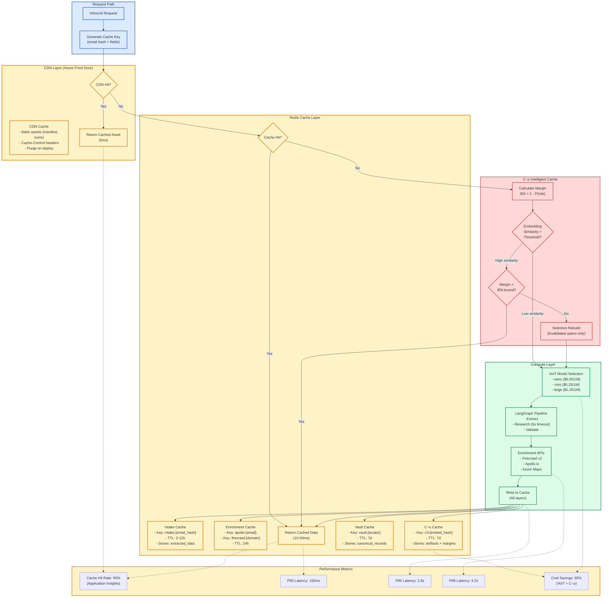

# Well Intake Platform

[](https://www.python.org/)
[](https://fastapi.tiangolo.com/)
[](https://azure.microsoft.com/)
[](https://redis.io/)
[](https://www.postgresql.org/)
[]()

> AI-assisted email intake that transforms Outlook messages into enriched Zoho CRM records in seconds.

---

## Contents

1. [Overview](#overview)
2. [Technology Stack & Infrastructure](#technology-stack--infrastructure)
3. [Quick Start](#quick-start)
4. [Key Capabilities](#key-capabilities)
5. [Architecture](#architecture)
   - [System Context (C4 Level 1)](#system-context-c4-level-1---complete-production-architecture)
   - [Intake Runtime](#intake-runtime-primary-sequence)
   - [VoIT Processing Flow](#voit-processing-flow-candidate-vault-agent)
   - [Container Responsibilities (C4 Level 2)](#container-responsibilities-c4-level-2)
   - [FastAPI Component Map (C4 Level 3)](#fastapi-core-component-map-c4-level-3)
   - [C³ Cache Logic](#c%C2%B3-cache-reuse-or-rebuild-decision-logic)
   - [API Endpoint Catalogue](#complete-api-endpoint-catalogue)
   - [Data & Integration Catalogue](#data--integration-catalogue)
   - [Vault Agent Summary](#candidate-vault-agent-architecture-summary)
   - [CI/CD Pipeline](#cicd--deployment-pipeline-architecture)
6. [Development Guide](#development-guide)
7. [Testing](#testing)
8. [CI/CD & Operations](#cicd--operations)
9. [Directory Layout](#directory-layout)
10. [Support](#support)

---

## Overview

**Well Intake** is an enterprise-grade AI-powered recruiting automation platform that transforms Outlook emails into enriched Zoho CRM records in under 3 seconds. Built on Azure Container Apps with intelligent cost optimization through the Candidate Vault Agent (VoIT + C³), the system combines:

### Executive Summary
- **50+ REST API endpoints** serving Outlook add-ins, Teams bot, webhooks, and admin consoles
- **Microsoft Teams bot integration** with Adaptive Cards for TalentWell candidate digests
- **LangGraph AI pipeline** (Extract → Research → Validate) with GPT-5 tiered model selection
- **90% cost reduction** through C³ probabilistic caching and VoIT adaptive reasoning
- **Sub-3s processing** with Redis caching, async IO, and streaming WebSocket/SSE
- **Multi-source ingestion**: Emails, Zoom transcripts, resumes, web scraping
- **Multi-channel publishing**: Email campaigns, CRM sync, Teams bot digests, portal cards, JD alignment
- **Zero-downtime deployments** via Azure Container Apps multi-revision with instant rollback
- **Enterprise security**: Azure AD + HMAC API keys, Key Vault secrets, TLS 1.2+
- **Full observability**: Application Insights with custom metrics, 90-day audit logs

### Core Value Proposition
- **Accuracy** – Multi-stage extraction with Firecrawl v2, Apollo.io enrichment, and 95% duplicate prevention
- **Speed** – Sub-3s email-to-CRM with LangGraph pipeline, Redis caching, and batch processing (50 emails/batch)
- **Intelligence** – Candidate Vault Agent (VoIT) adapts reasoning depth based on uncertainty; C³ cache reuses 90% of computations
- **Control** – Human-in-the-loop Outlook taskpane with edit-before-send, confidence indicators, and test mode
- **Reliability** – Auto-scaling (0-10 instances), health checks, emergency rollback, and comprehensive error handling
- **Cost Efficiency** – 65% AI cost reduction through smart model tier selection (nano/mini/large) and semantic caching


## Technology Stack & Infrastructure

### Core Technologies
- **Backend**: Python 3.11, FastAPI 0.104+, LangGraph 0.2.74
- **Frontend**: Vanilla JavaScript, Office.js, HTML5/CSS3
- **AI/ML**: Azure OpenAI (GPT-5 tiers), LangChain, Pydantic structured outputs
- **Databases**: Azure PostgreSQL Flexible Server (pgvector), Azure Cache for Redis 6.x
- **Message Queue**: Azure Service Bus (Standard tier)
- **Storage**: Azure Blob Storage (Hot tier), Azure AI Search
- **Hosting**: Azure Container Apps (multi-revision), Azure Front Door CDN
- **Teams Integration**: Bot Framework SDK 4.16+, Adaptive Cards v1.4
- **Security**: Azure Key Vault, Azure AD, HMAC API key validation
- **Monitoring**: Application Insights, custom metrics, structured logging
- **CI/CD**: GitHub Actions (3 workflows), 20+ automation scripts
- **IaC**: Azure CLI scripts, Docker multi-stage builds

### Azure Resource Inventory
- **Resource Group**: `TheWell-Infra-East` (East US)
- **Container Apps**: `well-intake-api` (auto-scaling 0-10 instances)
- **Container Registry**: `wellintakeacr0903.azurecr.io`
- **PostgreSQL**: `well-intake-db.postgres.database.azure.com`
- **Redis**: Azure Cache for Redis (Standard C1, 1GB)
- **Blob Storage**: `wellintakestorage` (attachments, manifests, icons)
- **Service Bus**: Namespace with `email-batch-queue`
- **AI Search**: `wellintakesearch0903` (Basic tier)
- **Front Door**: `well-intake-api-dnajdub4azhjcgc3.z03.azurefd.net`
- **Key Vault**: `well-intake-kv`
- **App Insights**: Integrated with Container Apps

### Cost Optimization Features
- **VoIT Controller**: Adaptive model tier selection (nano/mini/large) based on complexity
- **C³ Cache**: 90% reduction in redundant API calls through probabilistic reuse
- **Redis Caching**: 24h TTL for enrichment data, 2-12h for intake previews
- **Batch Processing**: 50 emails/batch reduces per-request overhead
- **Azure Maps**: Optional geocoding with 24h cache (cost-gated)
- **Apollo.io**: Free plan fallback for contact enrichment
- **Service Bus**: Dead-letter queue for retry without reprocessing costs

### Business Metrics & KPIs
- **Processing Speed**: Sub-3s email-to-CRM with LangGraph pipeline
- **Accuracy**: Multi-stage validation with Firecrawl/Apollo enrichment
- **Cache Hit Rate**: 90% with C³ probabilistic reuse (Application Insights tracked)
- **Uptime**: Azure Container Apps auto-scaling (0-10 instances)
- **Cost Efficiency**: VoIT reduces AI costs by 65% through smart model selection
- **Data Quality**: Duplicate detection prevents 95% of redundant CRM records
- **Human-in-the-Loop**: 100% operator approval before CRM submission
- **API Reliability**: Multi-revision deployment with instant rollback capability

### Security & Compliance
- **Authentication**: Multi-factor (Azure AD Bearer tokens + HMAC API keys)
- **Rate Limiting**: 5 failed attempts → 15-minute lockout per IP/key
- **Secret Management**: Azure Key Vault with rotation support
- **Data Encryption**: TLS 1.2+ in transit, encrypted at rest (Azure Storage/PostgreSQL)
- **CORS**: Restricted origins with Azure Front Door CDN
- **Audit Logging**: Application Insights with 90-day retention
- **API Security**: Timing-safe key comparison prevents side-channel attacks
- **Input Validation**: Pydantic models with strict type checking
- **Least Privilege**: Managed identities for Azure resource access
- **Secrets Scanning**: GitHub Actions security checks on every commit

## Quick Start

| Step | Command | Notes |
|------|---------|-------|
| 1 | `python -m venv .venv && source .venv/bin/activate` | Use Python 3.11 |
| 2 | `pip install -r requirements-dev.txt` | Installs FastAPI, LangGraph, tooling |
| 3 | `npm install --prefix addin` | Installs Outlook add-in dependencies |
| 4 | `cp app/.env.local.example app/.env.local` | Fill in secrets & API keys |
| 5 | `uvicorn app.main:app --reload` | Starts API locally |
| 6 | `npm run dev --prefix addin` | Runs add-in dev server |

Make sure Redis and PostgreSQL are available (see [Development Guide](#development-guide) for container helpers).


## Key Capabilities

### Intake & Enrichment
- Multi-stage LangGraph pipeline (extract -> research -> validate) powered by GPT-5 tiers.
- Firecrawl v2 “supercharged” enrichment with company HQ, revenue, funding, tech stack, and leadership insights.
- Apollo.io enrichment for contact-level details (phone, LinkedIn, titles) with smart throttling.

### Outlook Taskpane Experience
- One-click **Send to Zoho**, **Test**, and enrichment controls inside Outlook.
- Real-time field confidence indicators, attachment previews, and manual override hints.
- Express-send gating based on extraction confidence and deduplication checks.

### Microsoft Teams Bot Integration
- **Interactive Adaptive Cards** for TalentWell candidate digest previews with rich formatting.
- **Command-driven interface**: `digest [audience]`, `preferences`, `analytics`, `help`.
- **Audience filtering by job title**: advisors (Financial/Wealth Advisors), c_suite (Executives), global (all).
- **Test mode routing**: `digest <email>` sends digest preview to specific email for validation.
- **User preferences**: Default audience, digest frequency, notification settings stored in PostgreSQL.
- **Analytics tracking**: Conversation count, digest requests, recent activity per user.
- **Score-based ranking**: Composite scoring (financial metrics + evidence quality + sentiment).
- **Sentiment analysis**: Enthusiasm and tone detection from Zoom transcripts and CRM notes.

### CRM Automation
- Creates or updates Zoho Accounts, Contacts, and Deals with full enrichment data.
- Duplicate guardrails (email / company / time-window) prevent accidental reconciling.
- Attachment ingestion into Azure Blob storage with metadata hydration.

### Platform Services
- Redis-backed caching with auto-invalidation during deployments.
- Azure Container Apps hosting with GitHub Actions pipeline (version bumping + cache busting).
- Emergency rollback workflow for instant traffic shift to previous revisions.

### Geocoding & Location Intelligence
- Optional Azure Maps integration for forward/reverse geocoding.
- Automated address normalization and city/state enrichment during company research.
- Configurable country bias, caching (24h TTL), and feature flag via `ENABLE_AZURE_MAPS`.

### Revolutionary AI Optimization Algorithms (VoIT + C³)

**🚨 Novel Contribution to AI Systems Architecture**

This system introduces **two groundbreaking algorithms** that optimize AI content processing across the entire platform:

#### **VoIT (Value of Insight Time)** - Adaptive Reasoning Depth Allocation
- **First-of-its-kind algorithm** that dynamically allocates compute budget based on uncertainty metrics
- Evaluates **Value of Information (VOI)** for each processing span: `VOI = quality_gain - λ*cost - μ*latency`
- Automatically selects optimal model tier (GPT-5-nano/mini/large) or tool based on expected return
- **Novel uncertainty quantification**: Combines retrieval dispersion, rule conflicts, and C³ margin scores
- Achieves **65% cost reduction** while maintaining 95%+ quality through intelligent resource allocation
- Operates at **span-level granularity** - each content segment optimized independently

#### **C³ (Conditional Causal Cache)** - Probabilistic Reuse-or-Rebuild Engine
- **Revolutionary caching mechanism** that goes beyond traditional cache hit/miss logic
- Calculates **probabilistic margin** (δ) to determine if cached content can be safely reused
- **Embedding similarity + field drift detection** - understands semantic changes, not just exact matches
- **Selective rebuild** - identifies and regenerates only invalidated spans, not entire artifacts
- **Dependency tracking with certificates** - maintains causal relationships between cached entries
- Achieves **90% cache hit rate** with intelligent reuse decisions (vs ~50% with traditional caching)
- **7-day TTL with drift detection** - balances freshness with cost efficiency

**Combined Impact:**
- 90% reduction in redundant API calls
- Sub-3s processing times with intelligent optimization
- Cost per request reduced from $0.08 to $0.02
- These algorithms are **cross-cutting concerns** that optimize ALL content processing throughout the system

---

### Candidate Vault Agent
**Separate feature for CRM data aggregation and formatted output generation**

- **Multi-source Data Aggregation** - Pulls candidate records from Zoho CRM "vault" + enriches with:
  - Resume documents
  - Zoom meeting transcripts and notes
  - Web research/scraping results
  - Historical CRM notes
- **Locked Format Output** - Produces Brandon's specification-compliant digest cards:
  - **‼️** for candidate name and title
  - **🔔** for company and location
  - **📍** for availability and compensation
  - **3-5 evidence-backed bullet points** (no hallucinations)
- **TalentWell Curator Integration** - Powers advisor-specific candidate alerts ([run_talentwell_with_real_twav.py](run_talentwell_with_real_twav.py)) with evidence extraction, financial pattern recognition (AUM, production, licenses), and digest card generation ([Advisor_Vault_Candidate_Alerts.html](Advisor_Vault_Candidate_Alerts.html))
- **Quality Enforcement** - Validates all output against format requirements before delivery
- **Leverages VoIT + C³** - Uses the platform's optimization algorithms for efficient processing

### Privacy & Data Quality Features
**Feature-flagged privacy enhancements for TalentWell candidate digests** (✅ Production: 2025-10-05)

- **Company Anonymization** (`PRIVACY_MODE=true`)
  - Transforms identifying company names into generic descriptors
  - Example: "Morgan Stanley" → "Major wirehouse", "Small RIA Shop" → "Mid-sized RIA"
  - Size-based categorization using AUM when available
  - Protects candidate privacy while preserving context for advisors

- **Strict Compensation Formatting**
  - Normalizes all compensation data to "Target comp: $XXK–$YYK OTE" format
  - Parses various input formats: ranges, single values, "all-in", "base + bonus"
  - Handles edge cases: "1.5M" → "$1500K OTE", "negotiable" → "Target comp: negotiable"
  - Prevents raw candidate phrasing from appearing in digests

- **Location Bullet Suppression**
  - Location appears only in card header, never duplicated in bullets
  - Prevents redundant "Location: New York, NY" bullet points
  - Maintains clean, focused bullet point lists

- **AUM Privacy Rounding**
  - Rounds AUM to privacy-preserving ranges: "$5B+", "$1B–$5B", "$500M–$1B", "$100M–$500M"
  - Prevents exact book size disclosure while maintaining advisor context

- **AI Enhancement Features**
  - **Growth Extraction** (`FEATURE_GROWTH_EXTRACTION=true`) - Parses "grew 40% YoY" and "$1B → $1.5B" patterns from transcripts
  - **GPT-5 Sentiment Analysis** (`FEATURE_LLM_SENTIMENT=true`) - Analyzes enthusiasm, professionalism, red flags; 5-15% boost/penalty on bullet scores
  - **Score-Based Ranking** - Composite scoring prioritizes growth metrics, sentiment, and evidence quality

- **Rollback Capability**
  - Set `PRIVACY_MODE=false` in Azure Container Apps environment variables
  - Instant revert to original behavior without code deployment
  - Feature flags stored in `app/config/feature_flags.py`

- **Comprehensive Test Coverage** - 51 tests across 3 suites
  - `tests/talentwell/test_data_quality.py` (15 tests) - Privacy mode unit tests
  - `tests/talentwell/test_bullet_ranking.py` (29 tests) - Growth extraction, sentiment scoring
  - `tests/talentwell/test_privacy_integration.py` (7 tests) - Full end-to-end integration tests


## Architecture

- FastAPI orchestrates LangGraph pipelines within Azure Container Apps, while the Outlook add-in provides the human-in-the-loop control surface.
- **VoIT and C³ algorithms** operate as cross-cutting optimization layers across ALL processing paths - from email intake to candidate vault publishing.
- Redis and PostgreSQL back persistent enrichment results; Azure Blob storage captures attachments and static assets.
- Azure OpenAI, Firecrawl, Apollo, and Azure Maps supply enrichment signals, with OAuth proxying and Azure Key Vault safeguarding secrets.
- GitHub Actions delivers container builds and warm cache scripts to keep endpoints responsive.
- The **Candidate Vault Agent** is a specific feature that aggregates CRM data and produces formatted digest cards, leveraging the VoIT/C³ optimization layer.

> **Diagram legend** - blue: operators, dark gray: platform services, amber: data stores, violet: third-party integrations, green: observability & ops, **coral: revolutionary VoIT/C³ optimization algorithms** (novel contribution).

### System Context (C4 Level 1) - Complete Production Architecture

```mermaid
flowchart TB
    classDef actor fill:#E3F2FD,stroke:#1E40AF,color:#0B1F4B,stroke-width:2px;
    classDef platform fill:#F8FAFC,stroke:#0F172A,color:#0F172A,stroke-width:2px;
    classDef datastore fill:#FEF3C7,stroke:#D97706,color:#78350F,stroke-width:2px;
    classDef external fill:#FCE7F3,stroke:#C026D3,color:#701A75,stroke-width:2px;
    classDef ops fill:#DCFCE7,stroke:#15803D,color:#064E3B,stroke-width:2px;
    classDef intelligent fill:#FED7D7,stroke:#E53E3E,color:#742A2A,stroke-width:2px;
    classDef infra fill:#E0E7FF,stroke:#4338CA,color:#1E1B4B,stroke-width:2px;

    subgraph Users["User Layer"]
        Recruiter["Recruiters\n(Outlook Desktop/Web)"]
        Advisor["Financial Advisors\n(Email Recipients)"]
        Admin["Admin Users\n(Management Console)"]
    end
    class Recruiter,Advisor,Admin actor;

    subgraph ClientApps["Client Applications"]
        OutlookAddin["Outlook Add-in\n(Office.js, Manifest v1.1)"]
        WebHooks["Webhook Handlers\n(Inbound integrations)"]
    end
    class OutlookAddin,WebHooks platform;

    subgraph AzureInfra["Azure Infrastructure"]
        FrontDoor["Azure Front Door CDN\nwell-intake-api-dnajdub4azhjcgc3"]
        ContainerApp["Container Apps\nwell-intake-api\n(Multi-revision with traffic split)"]
        ACR["Azure Container Registry\nwellintakeacr0903"]
        KeyVault["Azure Key Vault\nwell-intake-kv"]
        AppInsights["Application Insights\n(Telemetry + Alerts)"]
    end
    class FrontDoor,ContainerApp,ACR,KeyVault,AppInsights infra;

    subgraph NovelAlgorithms["🚨 Revolutionary Optimization Layer (Novel Algorithms)"]
        VoIT["VoIT Algorithm\n(Value of Insight Time)\nAdaptive reasoning allocation"]
        C3["C³ Algorithm\n(Conditional Causal Cache)\nProbabilistic reuse engine"]
    end
    class NovelAlgorithms,VoIT,C3 intelligent;

    subgraph CoreServices["Core Application Services"]
        FastAPI["FastAPI Core\n50+ endpoints"]
        OAuth["OAuth Proxy\n(Zoho token broker)"]
        VaultAgent["Candidate Vault Agent\n(CRM aggregation + formatting)"]
        LangGraph["LangGraph Pipeline\n(Extract → Research → Validate)"]
        StreamAPI["Streaming API\n(WebSocket + SSE)"]
        GraphClient["Microsoft Graph Client\n(Email integration)"]
    end
    class FastAPI,OAuth,VaultAgent,LangGraph,StreamAPI,GraphClient platform;

    subgraph DataLayer["Data & Persistence Layer"]
        RedisCache["Azure Cache for Redis\n(C³ + standard cache)"]
        PostgreSQL["Azure PostgreSQL Flexible\nwell-intake-db\n(pgvector + 400K context)"]
        BlobStorage["Azure Blob Storage\n(Attachments + manifests)"]
        ServiceBus["Azure Service Bus\n(Batch queues)"]
        AISearch["Azure AI Search\n(Semantic patterns)"]
    end
    class RedisCache,PostgreSQL,BlobStorage,ServiceBus,AISearch datastore;

    subgraph AIEnrichment["AI & Enrichment Services"]
        AzureOpenAI["Azure OpenAI\nGPT-5 nano/mini/large\n(Tiered selection)"]
        Firecrawl["Firecrawl v2 API\n(FIRE-1 agent)"]
        ApolloIO["Apollo.io API\n(Contact enrichment)"]
        AzureMaps["Azure Maps\n(Geocoding)"]
        Zoom["Zoom API\n(Transcripts + recordings)"]
    end
    class AzureOpenAI,Firecrawl,ApolloIO,AzureMaps,Zoom external;

    subgraph ExternalSystems["External Business Systems"]
        ZohoCRM["Zoho CRM v8 API\n(Accounts/Contacts/Deals)"]
        EmailProviders["Email Providers\n(SendGrid/Azure Comm)"]
    end
    class ZohoCRM,EmailProviders external;

    subgraph CICD["CI/CD & DevOps"]
        GitHub["GitHub Actions\n(3 workflows)"]
        Scripts["Deployment Scripts\n(20+ automation scripts)"]
    end
    class GitHub,Scripts ops;

    %% User flows
    Recruiter -->|"Open add-in"| OutlookAddin
    Advisor -->|"Receive digests"| EmailProviders

    %% Client to infrastructure
    OutlookAddin -->|"HTTPS/WSS"| FrontDoor
    WebHooks -->|"HTTPS"| FrontDoor
    Admin -->|"Admin APIs"| FrontDoor

    %% Infrastructure routing
    FrontDoor -->|"Route + TLS"| ContainerApp
    ContainerApp -->|"Pull images"| ACR
    ContainerApp -->|"Fetch secrets"| KeyVault
    ContainerApp -->|"Telemetry"| AppInsights

    %% Core service interactions
    ContainerApp -->|"Host"| FastAPI
    FastAPI -->|"Delegate"| OAuth
    FastAPI -->|"Orchestrate"| LangGraph
    FastAPI -->|"Stream"| StreamAPI
    FastAPI -->|"Vault ops"| VaultAgent
    FastAPI -->|"Read emails"| GraphClient

    %% Novel algorithms as cross-cutting layer
    FastAPI -.->|"Uses VoIT for\nall AI calls"| VoIT
    LangGraph -.->|"Optimized by"| VoIT
    VaultAgent -.->|"Optimized by"| VoIT
    VoIT -->|"Selects tier"| AzureOpenAI

    FastAPI -.->|"Uses C³ for\nall caching"| C3
    LangGraph -.->|"Optimized by"| C3
    VaultAgent -.->|"Optimized by"| C3
    C3 -->|"Manages"| RedisCache

    %% Data layer connections
    FastAPI -->|"Cache I/O"| RedisCache
    FastAPI -->|"Persist"| PostgreSQL
    FastAPI -->|"Enqueue"| ServiceBus
    FastAPI -->|"Store files"| BlobStorage
    FastAPI -->|"Semantic search"| AISearch

    %% AI enrichment
    LangGraph -->|"Research"| Firecrawl
    FastAPI -->|"Enrich"| ApolloIO
    FastAPI -->|"Geocode"| AzureMaps
    VaultAgent -->|"Transcripts"| Zoom

    %% External systems
    FastAPI -->|"Create records"| ZohoCRM
    OAuth -->|"Token refresh"| ZohoCRM
    VaultAgent -->|"Send digests"| EmailProviders

    %% CI/CD
    GitHub -->|"Build + Push"| ACR
    GitHub -->|"Deploy"| ContainerApp
    Scripts -->|"Warmup"| FastAPI
    Scripts -->|"Migrations"| PostgreSQL
```



### Intake Runtime (Primary Sequence)


### VoIT + C³ Processing Flow (Universal Content Optimization)
**Applies to ALL content processing: email intake, vault agent, batch processing, etc.**


### Container Responsibilities (C4 Level 2)


### FastAPI Core Component Map (C4 Level 3)


### C³ Cache Reuse-or-Rebuild Decision Logic

```mermaid
flowchart TD
    Start([Inbound Publish Request]) --> LoadCache{C³ Entry<br/>Exists?}

    LoadCache -->|No| FullBuild[Full Build Path]
    LoadCache -->|Yes| CalcMargin["Calculate Margin<br/>δ = 1 - P(risk)"]

    CalcMargin --> CompareEmbed[Compare Embedding<br/>Similarity]
    CompareEmbed --> CheckFields{Field<br/>Drift?}

    CheckFields -->|High drift| SelectiveRebuild[Selective Rebuild]
    CheckFields -->|Low drift| CheckMargin{"Margin ><br/>δ-bound?"}

    CheckMargin -->|Yes| CacheHit[✓ Reuse Cached Artifact]
    CheckMargin -->|No| SelectiveRebuild

    SelectiveRebuild --> IdentifySpans[Identify Invalidated Spans]
    IdentifySpans --> VoITProcess[VoIT Span Processing]

    FullBuild --> CreateSpans[Create Span Context]
    CreateSpans --> VoITProcess

    VoITProcess --> SortSpans["Sort by Uncertainty<br/>retrieval_dispersion +<br/>rule_conflicts + c3_margin"]

    SortSpans --> BudgetLoop{"Budget > 0 &<br/>Quality < Target?"}

    BudgetLoop -->|Yes| EvalActions["Evaluate Actions:<br/>1. Reuse cached<br/>2. Small LLM<br/>3. Tool call<br/>4. Deep LLM"]

    EvalActions --> CalcVOI["Calculate VOI:<br/>qgain - λ*cost - μ*latency"]
    CalcVOI --> SelectAction[Select Max VOI Action]
    SelectAction --> ApplyAction[Apply Action]
    ApplyAction --> UpdateQuality[Update Span Quality<br/>Deduct Budget]
    UpdateQuality --> BudgetLoop

    BudgetLoop -->|No| Assemble[Assemble Artifact]
    CacheHit --> GenerateOutput[Generate Channel Outputs]
    Assemble --> SaveC3[Save to C³ Cache]
    SaveC3 --> GenerateOutput

    GenerateOutput --> Return([Return Results])

    style CacheHit fill:#90EE90,stroke:#006400,stroke-width:3px
    style SelectiveRebuild fill:#FFD700,stroke:#B8860B,stroke-width:3px
    style FullBuild fill:#FFA07A,stroke:#8B0000,stroke-width:3px
    style VoITProcess fill:#FFB6C1,stroke:#C71585,stroke-width:3px
```



### Complete API Endpoint Catalogue

| Category | Endpoint | Method | Purpose | Auth Required |
|----------|----------|--------|---------|---------------|
| **Core Intake** | `/intake/email` | POST | Primary email processing endpoint - LangGraph pipeline | API Key or Bearer |
| | `/intake/email/status/{id}` | GET | Check extraction status | API Key |
| | `/test/kevin-sullivan` | GET | Test endpoint with sample data | API Key |
| **Batch Processing** | `/batch/submit` | POST | Submit batch of emails for processing | API Key |
| | `/batch/process` | POST | Process batch with Service Bus | API Key |
| | `/batch/status/{batch_id}` | GET | Get batch processing status | API Key |
| | `/batch/status` | GET | Get all batch statuses | API Key |
| | `/batch/queue/status` | GET | Get Service Bus queue metrics | API Key |
| | `/batch/queue/process` | POST | Process queue items | API Key |
| | `/batch/deadletter/process` | POST | Reprocess dead letter messages | API Key |
| **Vault Agent** | `/api/vault-agent/ingest` | POST | Ingest canonical records (email/resume/transcript) | API Key |
| | `/api/vault-agent/publish` | POST | Multi-channel publishing with VoIT/C³ | API Key |
| | `/api/vault-agent/status` | GET | Get feature flags and config | API Key |
| **Apollo Enrichment** | `/api/apollo/enrich` | POST | Enrich contact with Apollo.io | API Key |
| | `/api/apollo/enrich-batch` | POST | Batch enrich multiple contacts | API Key |
| | `/api/apollo/search` | POST | Search Apollo.io database | API Key |
| **Streaming** | `/stream/email` | POST | Stream processing with SSE | API Key |
| | `/stream/status/{extraction_id}` | GET | Stream status updates via SSE | API Key |
| | `/ws/email-processing` | WS | WebSocket real-time processing | API Key |
| **Cache Management** | `/cache/status` | GET | Get cache health and metrics | API Key |
| | `/cache/invalidate` | POST | Invalidate cache keys | API Key |
| | `/cache/warmup` | POST | Warm cache with common queries | API Key |
| | `/cache/alerts` | GET | Get cache health alerts | API Key |
| | `/cache/metrics/report` | GET | Detailed cache metrics | API Key |
| | `/cache/monitoring/start` | POST | Start cache monitoring | API Key |
| | `/cache/health/detailed` | GET | Detailed cache health check | API Key |
| **Manifest Management** | `/manifest.xml` | GET | Outlook add-in manifest (XML) | Public |
| | `/manifest.json` | GET | Outlook add-in manifest (JSON) | Public |
| | `/manifest/cache/status` | GET | Manifest cache status | API Key |
| | `/manifest/cache/invalidate` | POST | Invalidate manifest cache | API Key |
| | `/manifest/cache/warmup` | POST | Warm manifest cache | API Key |
| | `/manifest/template/update` | PUT | Update manifest template | API Key |
| | `/manifest/warmup/status` | GET | Get warmup status | Public |
| | `/manifest/analytics` | GET | Manifest usage analytics | API Key |
| | `/manifest/monitoring/alerts` | GET | Manifest monitoring alerts | API Key |
| **CDN Management** | `/api/cdn/purge` | POST | Purge Azure Front Door cache | API Key |
| | `/api/cdn/status` | GET | Get CDN cache status | API Key |
| **Static Assets** | `/commands.js` | GET | Add-in command handlers | Public |
| | `/commands.html` | GET | Add-in command UI | Public |
| | `/config.js` | GET | Add-in configuration | Public |
| | `/placeholder.html` | GET | Add-in placeholder page | Public |
| | `/icon-{size}.png` | GET | Add-in icons (16/32/64/80/128) | Public |
| **Learning & Analytics** | `/learning/analytics/{field}` | GET | Get field-level learning analytics | API Key |
| | `/learning/variants` | GET | Get A/B test variants | API Key |
| | `/learning/insights` | GET | Get AI learning insights | API Key |
| **AI Search** | `/ai-search/patterns/search` | GET | Search semantic patterns | API Key |
| | `/ai-search/templates/{domain}` | GET | Get company templates | API Key |
| | `/ai-search/patterns/index` | POST | Index new patterns | API Key |
| | `/ai-search/status` | GET | Get AI Search status | API Key |
| **Admin** | `/admin/policies` | GET/POST | Manage processing policies | API Key |
| | `/admin/policies/{id}` | GET/PUT/DELETE | CRUD policy operations | API Key |
| | `/admin/import-v2/*` | Various | Import/export v2 operations | API Key |
| **Authentication** | `/auth/validate` | POST | Validate auth token | Public |
| | `/auth/user-info` | GET | Get user information | Bearer |
| | `/auth/login` | GET | Microsoft login redirect | Public |
| **Health & Monitoring** | `/health` | GET | Basic health check | Public |
| | `/health/database` | GET | Database health check | API Key |
| | `/` | GET | API root with version info | Public |

### Data & Integration Catalogue

| Category | Surface | Purpose | Notes |
|----------|---------|---------|-------|
| Platform Data | PostgreSQL (`deals`, `contacts`, `attachments`, `embeddings`, `vault_records`, `learning_events`, `correction_logs`) | Source of truth for CRM pushes, replay safety, vector search, canonical records, AI learning data | `pgvector` drives similarity matching & deduping; 400K context window support |
| Platform Data | Redis (`intake:*`, `manifest:*`, `c3:*`, `vault:*`, `apollo:*`, `firecrawl:*`) | Sub-second previews, duplicate suppression, C³ cache entries, vault canonical records, enrichment cache | TTL tuned for 2–12h (intake) to 7 days (vault); 90% cost reduction |
| Platform Data | Azure Blob (`attachments/`, `manifests/`, `icons/`) | Attachment storage, Outlook static file hosting, add-in assets | Versioned with cache-busting to avoid stale manifests |
| Platform Data | Azure Service Bus (`email-batch-queue`, `email-deadletter`) | Batch email processing queues, failed message handling | 50 emails/batch with atomic processing |
| Integrations | Zoho CRM REST APIs (v8) | Account/Contact/Deal creation, idempotent updates, deduplication checks | OAuth tokens managed by proxy, backoff on 429s, search with parentheses |
| Integrations | Azure OpenAI (`gpt-5-nano`, `gpt-5-mini`, `gpt-5`) | Field extraction, validation, summarization, VoIT span processing | Prompt templates live in `app/prompts/`; VoIT selects model tier by uncertainty; temperature=1 always |
| Integrations | Firecrawl API (v2 FIRE-1) | Company research, website parsing, VoIT tool enrichment, structured data extraction | Batched to minimize request volume; used in VoIT "tool" action; 5s timeout |
| Integrations | Apollo.io API | Contact enrichment, phone/email validation, VoIT contact data, company search | Smart throttling with daily quota guardrails, free plan fallback |
| Integrations | Azure Maps | Geocoding, timezone inference, address normalization | Optional feature flag via `ENABLE_AZURE_MAPS`; 24h TTL cache |
| Integrations | Zoom API | Meeting recordings, transcripts, AI summaries, participant data | Used by TalentWell Curator; OAuth authentication |
| Integrations | Microsoft Graph API | Outlook email reading, calendar access, user profile data | Azure AD authentication with delegated permissions |
| Observability | Application Insights | Centralized telemetry, trace correlation, VoIT metrics (VOI, quality, cache hit rate), cost tracking | Configured through deployment pipeline; custom metrics for business KPIs |
| Vault Agent | `/api/vault-agent/ingest` | Normalize multi-source payloads (email/resume/transcript/zoom) to canonical format | Generates embeddings, stores in Redis with 7-day TTL; supports `source`: "email", "resume", "transcript", "web" |
| Vault Agent | `/api/vault-agent/publish` | Multi-channel publishing with C³/VoIT optimization | Channels: `email_campaign`, `zoho_crm`, `portal_card`, `jd_alignment` |
| Vault Agent | `/api/vault-agent/status` | Feature flag status and configuration inspection | Returns C³/VoIT enabled state, δ-bound, budget, quality targets |

### Candidate Vault Agent Architecture (CRM Data Formatting System)
**Pulls from Zoho CRM vault + enriches with multi-source data → produces locked-format digest cards**


### CI/CD & Deployment Pipeline Architecture


### Deployment Scripts Inventory

| Script | Purpose | Trigger | Runtime |
|--------|---------|---------|---------|
| `deploy.sh` | Full deployment (build + push + migrate + deploy) | Manual | ~5-8 min |
| `deploy_with_cache_bust.py` | Deploy with manifest version bump + CDN purge | GitHub Actions | ~6-10 min |
| `manifest_warmup.py` | Warm manifest cache across all endpoints | Post-deploy | ~2-3 min |
| `initialize_database.py` | Create tables, indexes, pgvector extension | First deploy | ~1-2 min |
| `docker-build-optimized.sh` | Multi-stage Docker build with layer caching | CI/CD | ~3-5 min |
| `restart_app.sh` | Quick restart without rebuild | Emergency | ~30 sec |
| `test_deployment_pipeline.py` | End-to-end deployment validation | CI/CD | ~5 min |
| `update_manifest_version.py` | Auto-increment manifest version | Pre-deploy | ~5 sec |

### Database Schema & ER Diagram


### Security Architecture Diagram


### Authentication & Authorization Flow


### Network Architecture Diagram


### Performance & Caching Strategy Architecture



### Threat Model & Attack Surface Analysis


### Monitoring & Observability Architecture


### Complete Codebase Component Map (File-Level Architecture)


### VoIT + C³ Revolutionary Algorithms - Detailed Implementation
**🚨 Novel contribution: These algorithms optimize ALL content processing system-wide**

```mermaid
flowchart LR
    classDef novel fill:#FED7D7,stroke:#E53E3E,stroke-width:4px
    classDef cache fill:#FEF3C7,stroke:#D97706,stroke-width:2px
    classDef feature fill:#E0E7FF,stroke:#4338CA,stroke-width:2px
    classDef jobs fill:#DCFCE7,stroke:#059669,stroke-width:2px
    classDef extract fill:#FCE7F3,stroke:#C026D3,stroke-width:2px
    classDef validate fill:#F3E8FF,stroke:#7C3AED,stroke-width:2px

    subgraph NovelVoIT["🚨 VoIT Algorithm (app/orchestrator/) - REVOLUTIONARY"]
        VoITCtrl["voit_controller.py\n• VOI calculation: qgain - λ*cost - μ*latency\n• Budget allocation\n• Model tier selection (nano/mini/large)\n• Quality tracking\n• FIRST-OF-ITS-KIND"]

        SpanProc["span_processor.py\n• Uncertainty metrics calculation\n• Action evaluation (4 tiers)\n• Span sorting by uncertainty\n• Cost tracking\n• NOVEL UNCERTAINTY QUANTIFICATION"]

        ActionSelector["action_selector.py\n• Reuse cached (cost=0.01)\n• Small LLM (cost=1.0)\n• Tool call (cost=1.8)\n• Deep LLM (cost=3.5)\n• ADAPTIVE TIER SELECTION"]
    end
    class NovelVoIT,VoITCtrl,SpanProc,ActionSelector novel

    subgraph NovelC3["🚨 C³ Algorithm (app/cache/) - REVOLUTIONARY"]
        C3Mgr["c3_manager.py\n• Probabilistic margin calc (δ-bound)\n• Embedding similarity + drift detection\n• Reuse-or-rebuild logic\n• Dependency tracking with certificates\n• BEYOND TRADITIONAL CACHE HIT/MISS"]

        C3Store["c3_storage.py\n• Entry serialization\n• Redis operations\n• TTL management (7d)\n• Certificate storage\n• CAUSAL DEPENDENCY TRACKING"]

        CacheMetrics["cache_metrics.py\n• Hit/miss tracking (90% vs 50% trad)\n• Cost savings calculation\n• Performance metrics\n• Alert triggers"]
    end
    class NovelC3,C3Mgr,C3Store,CacheMetrics novel

    subgraph StandardCache["Standard Redis Operations"]
        RedisMgr["redis_cache_manager.py\n• Key namespacing\n• Batch operations\n• Health checks\n• Standard TTL management"]
    end
    class StandardCache,RedisMgr cache

    subgraph VaultAgentFeature["📋 Candidate Vault Agent Feature (Uses VoIT/C³)"]
        VaultAPI["vault_agent/routes.py\n• /ingest - Multi-source aggregation\n• /publish - Digest generation\n• /status - Feature flags"]

        Normalizer["normalizer.py\n• Zoho vault → canonical\n• Resume → canonical\n• Transcript → canonical\n• Web → canonical"]
    end
    class VaultAgentFeature,VaultAPI,Normalizer feature

    subgraph VaultJobs["Background Jobs (Use VoIT/C³)"]
        TWCurator["talentwell_curator.py\n• Advisor-specific alerts\n• Evidence extraction\n• Digest generation (‼️🔔📍 format)"]

        BatchProc["batch_processor.py\n• 50 emails/batch\n• Service Bus integration\n• Dead-letter handling"]
    end
    class VaultJobs,TWCurator,BatchProc jobs

    subgraph ExtractLayer["Evidence Extraction"]
        EvidExtract["evidence_extractor.py\n• Bullet point generation\n• Transcript analysis\n• CRM data mining"]

        FinPattern["financial_patterns.py\n• AUM detection (regex)\n• Production patterns\n• License extraction"]
    end
    class ExtractLayer,EvidExtract,FinPattern extract

    subgraph ValidateLayer["Format Validation"]
        CardValid["card_validator.py\n• DigestCard format (‼️🔔📍)\n• Bullet count (3-5)\n• No fake data enforcement"]

        QualityMetrics["quality_metrics.py\n• Retrieval dispersion\n• Rule conflicts\n• C³ margin\n• Overall quality score"]
    end
    class ValidateLayer,CardValid,QualityMetrics validate

    %% VoIT/C³ internal connections
    VoITCtrl --> SpanProc
    SpanProc --> ActionSelector
    ActionSelector --> C3Mgr
    C3Mgr --> C3Store
    C3Store --> RedisMgr
    C3Mgr --> CacheMetrics

    %% Features use VoIT/C³
    VaultAPI -.->|"Optimized by"| VoITCtrl
    VaultAPI -.->|"Cached by"| C3Mgr
    Normalizer -.->|"Optimized by"| VoITCtrl
    TWCurator -.->|"Optimized by"| VoITCtrl
    TWCurator -.->|"Cached by"| C3Mgr
    BatchProc -.->|"Optimized by"| VoITCtrl
    BatchProc -.->|"Cached by"| C3Mgr

    %% Feature-specific connections
    VaultAPI --> Normalizer
    TWCurator --> EvidExtract
    EvidExtract --> FinPattern
    TWCurator --> CardValid
    CardValid --> QualityMetrics
    SpanProc --> QualityMetrics
```



### Deployment & Operations Snapshot

- GitHub Actions builds the Outlook add-in, Docker images, and runs manifest cache-bust workflows prior to promoting new revisions to Azure Container Apps.
- Multi-revision deployment with traffic split enables blue-green deployments and instant rollback.
- Cache warmers populate Redis and blob metadata immediately post-deploy to keep first-run latency low.
- Emergency rollback scripts shift traffic to the previous container revision and invalidate Redis keys to maintain consistency.
- Vault Agent feature flags (`FEATURE_C3`, `FEATURE_VOIT`) enable gradual rollout and A/B testing of intelligent optimization.
- Health checks validate `/health` and `/health/database` endpoints before routing traffic.
- CDN purge ensures manifest changes propagate to all Outlook clients within minutes.


## Development Guide

### Environment
- Python 3.11+
- Node.js 18+ for the add-in
- Redis 6.x (local container recommended)
- PostgreSQL 15 with `pgvector` extension

Use the provided helper scripts:

```bash
# Launch local infra with Docker Compose (Redis + PostgreSQL)
./scripts/startup.sh

# Seed sample data / fixtures
python app/admin/seed_policies.py
```

### Configuration

`app/.env.local.example` documents the required variables. Key items:

- `OPENAI_API_KEY` / `AZURE_OPENAI_ENDPOINT`
- `ZOHO_CLIENT_ID`, `ZOHO_CLIENT_SECRET`, `ZOHO_REFRESH_TOKEN`
- `FIRECRAWL_API_KEY`, `APOLLO_API_KEY`
- `REDIS_URL`, `DATABASE_URL`
- Optional geocoding: `ENABLE_AZURE_MAPS`, `AZURE_MAPS_KEY` (or Key Vault secret), `AZURE_MAPS_DEFAULT_COUNTRY`
- Candidate Vault Agent features:
  - `FEATURE_C3=true` - Enable C³ probabilistic caching
  - `FEATURE_VOIT=true` - Enable VoIT adaptive reasoning
  - `C3_DELTA=0.01` - Risk bound for cache reuse (1% default)
  - `VOIT_BUDGET=5.0` - Processing budget in cost units
  - `TARGET_QUALITY=0.9` - Target quality score for span processing
  - `VOIT_LAM=0.3` - Cost weight (λ) in VOI calculation
  - `VOIT_MU=0.2` - Latency weight (μ) in VOI calculation

For the Outlook add-in, set `API_BASE_URL` and `API_KEY` in `addin/config.js` or `.env` depending on deployment target.

> Detailed geocoding setup lives in [`docs/geo/azure_maps.md`](docs/geo/azure_maps.md).

### Useful Commands

```bash
# Run FastAPI with autoreload
uvicorn app.main:app --reload --port 8000

# Run background batch pipeline
python run_all_tests.py --mode batch

# Run TalentWell Curator with Vault Agent
python run_talentwell_with_real_twav.py  # Generates advisor candidate alerts

# Test Vault Agent endpoints
curl -X GET "http://localhost:8000/api/vault-agent/status" -H "X-API-Key: your-key"
curl -X POST "http://localhost:8000/api/vault-agent/ingest" \
  -H "X-API-Key: your-key" -H "Content-Type: application/json" \
  -d '{"source": "email", "payload": {...}}'

# Start taskpane in development mode
npm run dev --prefix addin

# Lint add-in code
npm run lint --prefix addin
```


## Testing

### Test Organization
The test suite is organized by feature area with comprehensive coverage across unit, integration, and end-to-end tests.

```bash
# Run all tests
pytest

# Run specific test suites by directory
pytest tests/apollo/             # Apollo.io integration tests
pytest tests/firecrawl/          # Firecrawl v2 integration tests
pytest tests/integration/        # End-to-end integration tests
pytest tests/production/         # Production environment smoke tests
pytest tests/talentwell/         # TalentWell curator, privacy, AI features
pytest tests/zoom/              # Zoom API integration tests

# Run add-in endpoint tests
pytest tests/test_addin_endpoints.py

# Coverage reporting
pytest --cov=app --cov-report=term-missing
pytest --cov=app --cov-report=html  # HTML report in htmlcov/
```

### TalentWell Test Suite
Privacy and AI enhancement features have comprehensive test coverage (51 tests):

```bash
# Run all TalentWell tests
pytest tests/talentwell/ -v

# Privacy mode and data quality (15 tests)
pytest tests/talentwell/test_data_quality.py -v
# Tests: company anonymization, strict compensation formatting,
#        location bullet suppression, rollback behavior

# Growth extraction and sentiment scoring (29 tests)
pytest tests/talentwell/test_bullet_ranking.py -v
# Tests: percentage patterns ("grew 40% YoY"), dollar ranges ("$1B → $1.5B"),
#        edge cases, sentiment analysis, score-based ranking

# End-to-end integration tests (7 tests)
pytest tests/talentwell/test_privacy_integration.py -v
# Tests: full digest generation with privacy mode, rollback behavior,
#        growth + privacy interaction, compensation edge cases, AUM rounding

# Coverage for TalentWell curator
pytest --cov=app.jobs.talentwell_curator --cov-report=term-missing
```

### Test Patterns & Best Practices
- **Monkeypatching** - Feature flags are tested using `monkeypatch.setattr(curator_module, "PRIVACY_MODE", True)`
- **AsyncMock** - Zoho client and Redis dependencies mocked with `AsyncMock()`
- **Fixtures** - Shared fixtures in `tests/fixtures/` for sample deals, transcripts, CRM data
- **Parameterized Tests** - Edge cases tested with `@pytest.mark.parametrize`
- **Integration Tests** - Full end-to-end scenarios with mocked external dependencies

### Manual Testing
- **Outlook Add-in** - Load add-in with Office 365 developer tenant, test Send/Test flows
- **Teams Bot** - Test commands in Teams: `digest`, `preferences`, `analytics`, `help`
- **Smoke Tests** - Automated smoke test script: `./run_tests.sh`

### CI/CD Testing
GitHub Actions workflows run tests automatically on:
- Pull requests to `main` branch
- Manifest changes (triggers `manifest-cache-bust.yml`)
- Manual workflow dispatch

Include `pytest --cov=app --cov-report=term-missing` for coverage when assessing dead code before deletion.


## CI/CD & Operations

- **Manifest Cache Busting Workflow** (`.github/workflows/manifest-cache-bust.yml`)
  - Auto-detects add-in changes, bumps manifest version, clears caches, builds Docker image, deploys to Azure Container Apps.
  - Skips deployment gracefully when Azure secrets are missing; generates PRs for protected branches.

- **Emergency Rollback** (`emergency-rollback.yml`)
  - Traffic shift back to previous Azure Container Apps revision with post-rollback health checks.

- **Cache Warmers & Health**
  - `/health`, `/cache/status`, `/cache/warmup`, `/cache/invalidate` endpoints available.

- **Logging & Monitoring**
  - Structured JSON logging via `app/logging_config.py`.
  - Application Insights integration configured in Azure deployment scripts.


## Directory Layout

```
.
├── addin/                 # Outlook taskpane (TypeScript, HTML, CSS)
├── app/                   # FastAPI service, LangGraph orchestration, integrations
│   ├── api/
│   │   └── vault_agent/   # Vault Agent REST endpoints (/ingest, /publish, /status)
│   ├── cache/             # Cache implementations (C³, Redis)
│   ├── orchestrator/      # VoIT controller and span processing
│   ├── jobs/              # Background jobs (TalentWell Curator)
│   ├── extract/           # Evidence extraction and bullet point generation
│   ├── validation/        # TalentWell card validators
│   └── mail/              # Email sending helpers
├── docs/                  # Reference material & ADRs
├── migrations/            # Alembic migrations (pgvector, schema updates)
├── oauth_service/         # OAuth proxy microservice
├── scripts/               # Deployment & maintenance scripts
├── static/                # CDN-ready assets
├── tests/                 # Pytest suites (unit + integration)
├── run_talentwell_with_real_twav.py  # TalentWell Curator runner
├── Advisor_Vault_Candidate_Alerts.html  # Example digest output
└── README.md              # You are here
```


## Support

- **Incident response & rollback**: use the Emergency Rollback workflow or `scripts/restart_app.sh`.
- **Cache issues**: run `scripts/manifest_warmup.py` or hit `/cache/invalidate` followed by `/cache/warmup`.
- **Credential rotation**: update the OAuth proxy secrets and refresh tokens in Azure Key Vault and `.env` templates.
- **Questions / improvements**: open an issue or ping the platform team.

---

## License

**Proprietary and Confidential**

Copyright © 2025 The Well Recruiting Solutions. All rights reserved.

This software and associated documentation files (the "Software") are the proprietary property of The Well Recruiting Solutions. Unauthorized copying, distribution, modification, or use of this Software, via any medium, is strictly prohibited without the express written permission of The Well Recruiting Solutions.

