# 🏗️ Well Intake API - System Architecture

> **Enterprise-Grade AI Email Processing System**  
> *C4 Model Architecture Documentation with Azure Cloud Infrastructure*

## 📋 Table of Contents
- [System Context](#system-context-c4-level-1)
- [Container Architecture](#container-architecture-c4-level-2)
- [Component Architecture](#component-architecture-c4-level-3)
- [Deployment Architecture](#deployment-architecture)
- [Data Flow Diagrams](#data-flow-diagrams)
- [Innovation & Algorithms](#innovation--algorithms)
- [Infrastructure & Resources](#infrastructure--resources)

---

## 🌐 System Context (C4 Level 1)

```mermaid
graph TB
    subgraph Users["👥 System Users"]
        Recruiter["👤 Recruitment Team<br/>Processes candidate emails"]
        Admin["👨‍💼 System Admin<br/>Manages configuration & monitoring"]
        Analyst["📊 Data Analyst<br/>Reviews metrics & insights"]
        TeamsMember["👥 Teams User<br/>Requests candidate digests"]
    end
    
    subgraph WellIntake["🚀 Well Intake System"]
        API["Well Intake API<br/>FastAPI + LangGraph<br/>C³ Cache + VoIT Orchestration"]
        OAuth["OAuth Proxy Service<br/>well-zoho-oauth-v2<br/>Flask App Service"]
    end
    
    subgraph ExternalSystems["🌐 External Systems"]
        Outlook["📧 Microsoft 365<br/>Email Client + Add-in"]
        Teams["💬 Microsoft Teams<br/>Bot Framework + Adaptive Cards"]
        Zoho["📊 Zoho CRM v8<br/>CRM System"]
        OpenAI["🤖 Azure OpenAI<br/>well-intake-aoai (East US)<br/>well-intake-aoai-eus2 (East US 2)"]
        Firecrawl["🔍 Firecrawl v2 API<br/>Company Research & Fire Agent"]
        Apollo["🚀 Apollo.io API<br/>Contact Enrichment"]
    end
    
    subgraph AzureServices["☁️ Azure Infrastructure - TheWell-Infra-East"]
        Storage["📁 Blob Storage<br/>wellintakestorage0903<br/>wellattachments0903"]
        Postgres["🗄️ PostgreSQL Flexible<br/>well-intake-db-0903<br/>v15 + pgvector<br/>Standard_D2ds_v5"]
        Redis["⚡ Redis Cache<br/>wellintakecache0903<br/>v6.0 Premium"]
        ServiceBus["📨 Service Bus<br/>wellintakebus0903<br/>Standard tier"]
        Search["🔍 AI Search<br/>wellintakesearch0903<br/>Standard tier"]
        FrontDoor["🌍 Front Door CDN<br/>well-intake-frontdoor<br/>Premium tier + WAF"]
        AppInsights["📊 App Insights<br/>wellintakeinsights0903<br/>Monitoring & Analytics"]
        KeyVault["🔐 Key Vault<br/>well-intake-kv<br/>Secret management"]
        Registry["🐳 Container Registry<br/>wellintakeacr0903<br/>Basic SKU"]
        Communication["📧 Communication Services<br/>well-communication-services<br/>Email delivery"]
    end
    
    Recruiter -->|"Sends emails"| Outlook
    Admin -->|"Configures & monitors"| API
    Analyst -->|"Views analytics"| API
    TeamsMember -->|"Requests digests"| Teams

    Outlook -->|"REST/WebSocket"| API
    Teams -->|"Bot Framework Webhook"| API
    API -->|"OAuth/API v8"| OAuth
    OAuth -->|"API v8"| Zoho
    API -->|"GPT-5 API"| OpenAI
    API -->|"Research API"| Firecrawl
    API -->|"Adaptive Cards"| Teams
    
    API --> Storage
    API --> Postgres
    API --> Redis
    API --> ServiceBus
    API --> SignalR
    API --> Search
    FrontDoor --> API
    API --> AppInsights
    
    style API fill:#4A90E2,stroke:#2E5C8A,stroke-width:3px,color:#fff
    style OAuth fill:#7B68EE,stroke:#5A4FCF,stroke-width:2px,color:#fff
    style Postgres fill:#336791,stroke:#234A6F,stroke-width:2px,color:#fff
    style Redis fill:#DC382D,stroke:#B02920,stroke-width:2px,color:#fff
```

---

## 🏛️ Container Architecture (C4 Level 2)

```mermaid
graph TB
    subgraph Frontend["🖥️ Frontend Layer"]
        OutlookAddin["📮 Outlook Add-in<br/>JavaScript/Office.js<br/>manifest.xml"]
        AdminUI["🎛️ Admin Dashboard<br/>Python/FastAPI<br/>import_exports_v2"]
    end
    
    subgraph Gateway["🔐 API Gateway Layer"]
        FrontDoor["🌍 Azure Front Door<br/>CDN + WAF + Routing<br/>well-intake-frontdoor<br/>Premium tier"]
        OAuthProxy["🔑 OAuth Proxy Service<br/>Flask App Service<br/>well-zoho-oauth-v2<br/>TheWell-WebApps-Plan"]
    end
    
    subgraph Application["⚡ Application Layer"]
        FastAPI["🚀 FastAPI Server<br/>Python 3.11<br/>main.py"]
        
        subgraph Routers["📡 API Routers"]
            IntakeAPI["/intake/email<br/>Email processing"]
            BatchAPI["/batch/*<br/>Batch processing"]
            CacheAPI["/cache/*<br/>Cache management"]
            VaultAPI["/api/vault-agent/*<br/>Canonical records"]
            AdminAPI["/admin/*<br/>Policies & imports"]
            StreamAPI["/ws/*<br/>WebSocket streaming"]
            ManifestAPI["/manifest.xml<br/>Add-in manifest"]
            TeamsAPI["/api/teams/messages<br/>Teams bot webhook"]
        end
    end
    
    subgraph Intelligence["🧠 AI Processing Layer"]
        LangGraph["🔄 LangGraph Manager<br/>3-node StateGraph<br/>langgraph_manager.py"]
        C3Cache["💾 C³ Cache Engine<br/>Conformal caching<br/>cache/c3.py"]
        VoIT["🎯 VoIT Orchestrator<br/>Budget-aware selection<br/>cache/voit.py"]
        BusinessRules["📋 Business Rules<br/>Deal formatting<br/>business_rules.py"]
    end
    
    subgraph Data["🗄️ Data Layer"]
        PostgreSQL["🐘 PostgreSQL Flexible<br/>well-intake-db-0903<br/>v15 + pgvector<br/>Standard_D2ds_v5 (Central US)"]
        Redis["⚡ Redis Cache<br/>wellintakecache0903<br/>v6.0 with intelligent caching"]
        BlobStorage["📁 Blob Storage<br/>wellintakestorage0903<br/>wellattachments0903<br/>Hot tier + lifecycle policies"]
        AISearch["🔍 AI Search<br/>wellintakesearch0903<br/>Standard tier semantic indexing"]
    end
    
    subgraph Messaging["📨 Messaging & Communication Layer"]
        ServiceBus["📬 Service Bus<br/>wellintakebus0903<br/>Standard tier<br/>Batch processing queues"]
        Communication["📧 Azure Communication<br/>well-communication-services<br/>Email delivery infrastructure"]
        EmailService["📨 Email Service<br/>well-email-service<br/>Managed domains (emailthewell.com)"]
    end
    
    subgraph External["🌐 External Services"]
        AzureOpenAI["🤖 Azure OpenAI<br/>well-intake-aoai (East US)<br/>well-intake-aoai-eus2 (East US 2)<br/>GPT-5-mini, temperature=1"]
        Zoho["📊 Zoho CRM<br/>API v8<br/>Account/Contact/Deal creation"]
        Firecrawl["🔍 Firecrawl v2<br/>Fire Agent + Company research<br/>5s timeout with fallback"]
        Apollo["🚀 Apollo.io<br/>People Match API<br/>Contact enrichment"]
        MSGraph["📧 MS Graph<br/>Email access<br/>OAuth 2.0"]
        Teams["💬 Microsoft Teams<br/>Bot Framework SDK<br/>Adaptive Cards v1.4"]
    end
    
    OutlookAddin --> FrontDoor
    AdminUI --> FastAPI
    FrontDoor --> FastAPI
    FastAPI --> OAuthProxy
    
    FastAPI --> LangGraph
    LangGraph --> C3Cache
    C3Cache --> VoIT
    LangGraph --> BusinessRules
    
    FastAPI --> PostgreSQL
    FastAPI --> Redis
    FastAPI --> BlobStorage
    FastAPI --> AISearch
    FastAPI --> ServiceBus
    FastAPI --> Communication
    FastAPI --> EmailService

    VoIT --> AzureOpenAI
    OAuthProxy --> Zoho
    LangGraph --> Firecrawl
    LangGraph --> Apollo
    FastAPI --> MSGraph
    FastAPI --> Teams
    
    style FastAPI fill:#4A90E2,stroke:#2E5C8A,stroke-width:3px,color:#fff
    style LangGraph fill:#9B59B6,stroke:#7D3C98,stroke-width:2px,color:#fff
    style C3Cache fill:#E74C3C,stroke:#C0392B,stroke-width:2px,color:#fff
    style PostgreSQL fill:#336791,stroke:#234A6F,stroke-width:2px,color:#fff
```

---

## 🏗️ Azure Resource Topology (Production Infrastructure)

```mermaid
graph TB
    subgraph "☁️ Azure Subscription: Microsoft Azure Sponsorship"
        subgraph "🗂️ TheWell-Infra-East (East US)"
            subgraph "🚀 Compute & Application Services"
                ContainerApps["🐳 well-intake-api<br/>Container Apps<br/>Auto-scale 1-10 instances<br/>well-intake-env"]
                AppService["🌐 well-zoho-oauth-v2<br/>App Service<br/>TheWell-WebApps-Plan"]
                Registry["📦 wellintakeacr0903<br/>Container Registry<br/>Basic SKU"]
            end

            subgraph "🗄️ Data & Storage Services"
                PostgreSQL["🐘 well-intake-db-0903<br/>PostgreSQL Flexible<br/>Standard_D2ds_v5<br/>(Central US)"]
                Redis["⚡ wellintakecache0903<br/>Redis Cache v6.0<br/>Intelligent caching"]
                BlobMain["📁 wellintakestorage0903<br/>Storage Account<br/>Hot tier"]
                BlobAttach["📎 wellattachments0903<br/>Storage Account<br/>Attachments"]
                BlobFunc["🔧 wellintakefunc0903<br/>Storage Account<br/>Functions"]
                BlobContent["📝 wellcontent0903<br/>Storage Account<br/>Content management"]
            end

            subgraph "🤖 AI & Cognitive Services"
                OpenAI1["🧠 well-intake-aoai<br/>Azure OpenAI<br/>East US Primary"]
                OpenAI2["🧠 well-intake-aoai-eus2<br/>Azure OpenAI<br/>East US 2 Secondary"]
                Search["🔍 wellintakesearch0903<br/>AI Search<br/>Standard tier"]
            end

            subgraph "📨 Messaging & Communication"
                ServiceBus["📬 wellintakebus0903<br/>Service Bus<br/>Standard tier"]
                CommServices["📧 well-communication-services<br/>Communication Services<br/>Global"]
                EmailService["📨 well-email-service<br/>Email Service<br/>emailthewell.com"]
            end

            subgraph "🌐 CDN & Networking"
                FrontDoor["🌍 well-intake-frontdoor<br/>Front Door CDN<br/>Premium + WAF<br/>Global"]
                FrontDoorEndpoint["🔗 well-intake-api<br/>Front Door Endpoint<br/>Global"]
            end

            subgraph "🔐 Security & Monitoring"
                KeyVault["🔐 well-intake-kv<br/>Key Vault<br/>Secret management"]
                AppInsights["📊 wellintakeinsights0903<br/>Application Insights<br/>Analytics & monitoring"]
                LogAnalytics["📋 well-intake-logs<br/>Log Analytics<br/>Centralized logging"]
                AlertGroup["🚨 Application Insights Smart Detection<br/>Action Group<br/>Global"]
            end

            subgraph "🔧 Additional App Services"
                LinkedInPublisher["📱 well-linkedin-publisher<br/>App Service<br/>EastUSPlan"]
                ScheduledPublisher["⏰ well-scheduled-publisher<br/>App Service<br/>EastUSPlan"]
                YouTubePublisher["📺 well-youtube-publisher<br/>App Service<br/>EastUSPlan"]
                ContentStudioAPI["🎨 well-content-studio-api<br/>Container Apps<br/>well-intake-env"]
            end
        end

        subgraph "🎯 Additional Resource Groups"
            ContentStudioRG["well-content-studio-rg<br/>Content management resources"]
            DefaultRG["DefaultResourceGroup-EUS<br/>Default resources"]
            AIInsightsRG["ai_wellintakeinsights0903_*_managed<br/>Auto-managed AI resources"]
        end
    end

    %% Connection flows
    FrontDoor --> AppService
    FrontDoor --> ContainerApps
    ContainerApps --> PostgreSQL
    ContainerApps --> Redis
    ContainerApps --> BlobMain
    ContainerApps --> BlobAttach
    ContainerApps --> ServiceBus
    ContainerApps --> Search
    ContainerApps --> OpenAI1
    ContainerApps --> OpenAI2
    ContainerApps --> KeyVault
    ContainerApps --> AppInsights

    AppService --> ContainerApps
    AppService --> KeyVault
    AppService --> Redis

    Registry --> ContainerApps

    CommServices --> EmailService
    ContainerApps --> CommServices

    AppInsights --> LogAnalytics
    AlertGroup --> AppInsights

    %% Styling
    classDef compute fill:#4A90E2,stroke:#2E5C8A,stroke-width:2px,color:#fff
    classDef data fill:#9B59B6,stroke:#7D3C98,stroke-width:2px,color:#fff
    classDef ai fill:#E74C3C,stroke:#C0392B,stroke-width:2px,color:#fff
    classDef messaging fill:#F39C12,stroke:#D68910,stroke-width:2px,color:#fff
    classDef network fill:#27AE60,stroke:#1E8449,stroke-width:2px,color:#fff
    classDef security fill:#E67E22,stroke:#D35400,stroke-width:2px,color:#fff
    classDef additional fill:#95A5A6,stroke:#7F8C8D,stroke-width:1px,color:#2C3E50

    class ContainerApps,AppService,Registry compute
    class PostgreSQL,Redis,BlobMain,BlobAttach,BlobFunc,BlobContent data
    class OpenAI1,OpenAI2,Search ai
    class ServiceBus,CommServices,EmailService messaging
    class FrontDoor,FrontDoorEndpoint network
    class KeyVault,AppInsights,LogAnalytics,AlertGroup security
    class LinkedInPublisher,ScheduledPublisher,YouTubePublisher,ContentStudioAPI additional
```

---

## 🔧 Component Architecture (C4 Level 3)

```mermaid
graph TB
    subgraph LangGraphWorkflow["🔄 LangGraph Workflow Engine (langgraph_manager.py)"]
        StateManager["📋 EmailProcessingState<br/>TypedDict with 25+ fields<br/>Learning-aware state"]
        ExtractNode["📤 extract_node()<br/>GPT-5-mini extraction<br/>Structured output"]
        ResearchNode["🔍 research_node()<br/>Firecrawl API<br/>Company validation"]
        ValidateNode["✅ validate_node()<br/>Business rules<br/>Data normalization"]
        BuildGraph["🏗️ build_graph()<br/>StateGraph assembly<br/>Node connections"]
        ErrorHandler["⚠️ SimplifiedEmailExtractor<br/>Fallback extraction<br/>Error recovery"]
    end
    
    subgraph C3CacheSystem["💾 C³ Cache System (cache/c3.py)"]
        C3Entry["📦 C3Entry<br/>Cached result<br/>Dependencies"]
        DependencyCert["🔐 DependencyCertificate<br/>Cache validation<br/>Risk bounds"]
        C3Reuse["♻️ c3_reuse_or_rebuild()<br/>Cache decision<br/>δ=0.01 risk"]
        Calibration["📊 update_calibration()<br/>Conformal scores<br/>Adaptive bounds"]
        RedisIO["💾 redis_io.py<br/>Save/load entries<br/>Vector storage"]
    end
    
    subgraph VoITOrchestrator["🎯 VoIT Orchestrator (cache/voit.py)"]
        VoITController["🎮 voit_controller()<br/>Main orchestrator<br/>Budget: 5.0 units"]
        ComplexityCalc["📊 calculate_complexity()<br/>Email scoring<br/>0.0-1.0 scale"]
        ModelSelect["🎯 select_model_tier()<br/>nano/mini/full<br/>Cost optimization"]
        QualityEval["✅ evaluate_quality()<br/>Score validation<br/>Target: 0.9"]
        BudgetTrack["💰 Budget Tracker<br/>Effort units<br/>Cost monitoring"]
    end
    
    subgraph BusinessLogic["📋 Business Rules (business_rules.py)"]
        RulesEngine["⚙️ BusinessRulesEngine<br/>apply_rules()<br/>Field normalization"]
        DealFormat["🏷️ format_deal_name()<br/>[Title] ([Location]) - [Firm]<br/>Pattern application"]
        SourceDetermine["🔍 determine_source()<br/>Email classification<br/>Source mapping"]
        OwnerAssign["👤 assign_owner()<br/>ZOHO_DEFAULT_OWNER<br/>Email lookup"]
    end
    
    subgraph Integration["🔌 Integration Layer"]
        ZohoClient["📊 ZohoApiClient<br/>integrations.py<br/>API v8 client"]
        PostgresClient["🐘 PostgreSQLClient<br/>integrations.py<br/>Deduplication"]
        BlobClient["📁 AzureBlobStorage<br/>integrations.py<br/>Attachments"]
        MSGraphClient["📧 MicrosoftGraphClient<br/>microsoft_graph_client.py<br/>Email access"]
        TeamsBotClient["💬 TeamsBotClient<br/>api/teams/routes.py<br/>Bot Framework webhooks"]
    end

    subgraph TeamsBot["💬 Teams Bot Components (api/teams/)"]
        AdaptiveCards["🎴 adaptive_cards.py<br/>Card layouts (welcome, help, digest, preferences)"]
        TeamsCurator["🎯 TalentWell Curator<br/>jobs/talentwell_curator.py<br/>Score-based ranking + sentiment"]
        TeamsDB["🗄️ Teams Database<br/>teams_conversations, teams_users<br/>Analytics & preferences"]
    end
    
    StateManager --> ExtractNode
    ExtractNode --> ResearchNode
    ResearchNode --> ValidateNode
    ValidateNode --> StateManager
    StateManager -.->|On error| ErrorHandler
    
    ExtractNode --> C3Reuse
    C3Reuse --> C3Entry
    C3Entry --> DependencyCert
    C3Reuse --> RedisIO
    C3Reuse --> Calibration
    
    StateManager --> VoITController
    VoITController --> ComplexityCalc
    ComplexityCalc --> ModelSelect
    ModelSelect --> QualityEval
    VoITController --> BudgetTrack
    
    ValidateNode --> RulesEngine
    RulesEngine --> DealFormat
    RulesEngine --> SourceDetermine
    RulesEngine --> OwnerAssign
    
    RulesEngine --> ZohoClient
    StateManager --> PostgresClient
    ExtractNode --> BlobClient
    StateManager --> MSGraphClient

    TeamsBotClient --> AdaptiveCards
    TeamsBotClient --> TeamsCurator
    TeamsBotClient --> TeamsDB
    TeamsCurator --> PostgresClient
    TeamsCurator --> ZohoClient
    
    style StateManager fill:#4A90E2,stroke:#2E5C8A,stroke-width:2px,color:#fff
    style C3Reuse fill:#E74C3C,stroke:#C0392B,stroke-width:2px,color:#fff
    style VoITController fill:#F39C12,stroke:#D68910,stroke-width:2px,color:#fff
    style RulesEngine fill:#27AE60,stroke:#1E8449,stroke-width:2px,color:#fff
```

---

## 🚀 Deployment Architecture

```mermaid
graph TB
    subgraph AzureCloud["☁️ Azure Cloud - Microsoft Azure Sponsorship"]
        subgraph ResourceGroups["🗂️ Resource Groups"]
            InfraRG["TheWell-Infra-East<br/>Primary infrastructure (East US)"]
            ContentRG["well-content-studio-rg<br/>Content management (East US)"]
            DefaultRG["DefaultResourceGroup-EUS<br/>Default resources (East US)"]
            AIRGroup["ai_wellintakeinsights0903_*_managed<br/>Auto-managed AI resources"]
        end

        subgraph ContainerApps["🐳 Container Apps Environment"]
            API["well-intake-api<br/>FastAPI Container<br/>well-intake-env<br/>Auto-scale: 1-10"]
            ContentAPI["well-content-studio-api<br/>Content Studio Container<br/>well-intake-env"]
            OAuthApp["well-zoho-oauth-v2<br/>Flask App Service<br/>TheWell-WebApps-Plan"]
            LinkedInApp["well-linkedin-publisher<br/>LinkedIn Publisher<br/>EastUSPlan"]
            ScheduledApp["well-scheduled-publisher<br/>Scheduled Publisher<br/>EastUSPlan"]
            YouTubeApp["well-youtube-publisher<br/>YouTube Publisher<br/>EastUSPlan"]
        end
        
        subgraph Database["🗄️ Database Services"]
            PostgresFlexible["well-intake-db-0903<br/>PostgreSQL Flexible Server v15<br/>Standard_D2ds_v5 (General Purpose)<br/>pgvector extension<br/>Central US location"]
        end
        
        subgraph Caching["⚡ Cache Services"]
            RedisCache["wellintakecache0903<br/>Redis Cache v6.0<br/>Intelligent caching<br/>Pattern recognition"]
        end
        
        subgraph Storage["📁 Storage Services"]
            BlobStorage["wellintakestorage0903<br/>Primary storage<br/>Hot tier + lifecycle policies"]
            AttachmentStorage["wellattachments0903<br/>Attachment storage<br/>Hot tier"]
            FuncStorage["wellintakefunc0903<br/>Function storage<br/>Azure Functions"]
            ContentStorage["wellcontent0903<br/>Content storage<br/>Content management"]
        end
        
        subgraph Messaging["📨 Messaging & Communication Services"]
            ServiceBus["wellintakebus0903<br/>Service Bus<br/>Standard tier<br/>Batch processing queues"]
            CommServices["well-communication-services<br/>Communication Services<br/>Email delivery infrastructure"]
            EmailService["well-email-service<br/>Email Service<br/>Managed domains:<br/>- emailthewell.com<br/>- AzureManagedDomain"]
        end
        
        subgraph SearchAI["🔍 Search & AI Services"]
            AISearch["wellintakesearch0903<br/>AI Search<br/>Standard tier<br/>Semantic search + Vector indexes"]
            OpenAI1["well-intake-aoai<br/>Azure OpenAI<br/>East US Primary<br/>GPT-5-mini deployment"]
            OpenAI2["well-intake-aoai-eus2<br/>Azure OpenAI<br/>East US 2 Secondary<br/>Load balancing"]
        end

        subgraph Monitoring["📊 Monitoring & Analytics"]
            AppInsights["wellintakeinsights0903<br/>Application Insights<br/>Analytics & monitoring"]
            LogWorkspace["well-intake-logs<br/>Log Analytics Workspace<br/>Centralized logging"]
            AlertGroup["Application Insights Smart Detection<br/>Action Group<br/>Global alerts"]
        end
        
        subgraph Network["🌐 Networking & CDN"]
            FrontDoor["well-intake-frontdoor<br/>Front Door CDN Profile<br/>Premium tier + WAF<br/>Global PoPs"]
            FrontDoorEndpoint["well-intake-api<br/>Front Door Endpoint<br/>Global distribution"]
        end

        subgraph Security["🔐 Security & Key Management"]
            KeyVault["well-intake-kv<br/>Key Vault<br/>Secret management<br/>HSM-backed"]
        end

        subgraph Registry["📦 Container Registry"]
            ACR["wellintakeacr0903<br/>Container Registry<br/>Basic SKU<br/>Docker image repository"]
        end
    end
    
    subgraph GitHubActions["🔧 CI/CD Pipeline"]
        Workflow["GitHub Actions<br/>deploy-production.yml<br/>deploy-simple.yml"]
    end
    
    Workflow -->|Push images| ACR
    ACR -->|Deploy| API
    
    FrontDoor -->|Route traffic| API
    FrontDoor -->|Route OAuth| OAuthApp
    
    API --> PostgresFlexible
    API --> RedisCache
    API --> BlobStorage
    API --> ServiceBus
    API --> SignalR
    API --> AISearch
    API --> AppInsights
    
    OAuthApp --> RedisCache
    
    style API fill:#4A90E2,stroke:#2E5C8A,stroke-width:3px,color:#fff
    style PostgresFlexible fill:#336791,stroke:#234A6F,stroke-width:2px,color:#fff
    style RedisCache fill:#DC382D,stroke:#B02920,stroke-width:2px,color:#fff
    style FrontDoor fill:#FF6B35,stroke:#CC5429,stroke-width:2px,color:#fff
```

---

## 🛠️ Technology Stack & Dependencies

### Core Application Framework
- **FastAPI 0.104.1** - Modern Python web framework with automatic OpenAPI documentation
- **Python 3.11** - Runtime environment with latest performance optimizations
- **Uvicorn 0.24.0** - ASGI server for production deployment
- **Gunicorn 21.2.0** - Production WSGI server with worker management

### AI & Machine Learning
- **LangGraph 0.2.74** - Advanced AI workflow orchestration (replaced CrewAI)
- **LangChain Core 0.3.29** - Foundation for LLM applications
- **LangChain OpenAI 0.2.14** - OpenAI integration layer
- **OpenAI ≥1.58.1** - GPT-5 model access and API client
- **TikToken ≥0.7** - Token counting for cost calculation
- **NumPy 1.24.3** - Scientific computing foundation
- **SciPy 1.11.4** - Advanced mathematical algorithms

### Data & Persistence
- **PostgreSQL 15** - Primary database with advanced features
  - **asyncpg 0.29.0** - Async PostgreSQL driver
  - **psycopg2-binary 2.9.9** - Traditional PostgreSQL adapter
  - **pgvector 0.2.5** - Vector similarity search extension
- **Redis 6.0** - Intelligent caching and session storage
  - **redis 5.0.1** - Python Redis client with clustering support
- **Pandas 2.0.3** - Data manipulation and CSV processing

### Azure Cloud Services
- **Azure Storage Blob 12.19.0** - File and attachment storage
- **Azure Service Bus 7.11.4** - Message queuing and batch processing
- **Azure Search Documents 11.4.0** - Semantic search and indexing
- **Azure Key Vault Secrets 4.7.0** - Secret management
- **Azure Key Vault Keys 4.8.0** - Cryptographic key operations
- **Azure Identity 1.15.0** - Managed identity authentication
- **Azure Core 1.29.6** - Common Azure SDK functionality
- **Azure Communication Email 1.0.0** - Email delivery service
- **Azure Monitor OpenTelemetry 1.2.0** - Performance monitoring
- **Azure Monitor Query 1.2.0** - Log analytics and querying
- **Azure Management Front Door 1.1.0** - CDN management
- **Azure Management CDN 13.1.1** - Content delivery network

### Web & API Technologies
- **Pydantic 2.8.2** - Data validation and serialization
- **Pydantic Core 2.20.1** - High-performance validation core
- **Requests 2.31.0** - HTTP library for external API calls
- **HTTPX 0.25.2** - Modern async HTTP client
- **AIOHTTP 3.9.1** - Async HTTP client/server framework
- **WebSockets 12.0** - Real-time communication protocol
- **SSE-Starlette 1.8.2** - Server-sent events for streaming
- **Python-Multipart 0.0.6** - File upload handling

### External Integrations
- **Firecrawl-py 4.3.6** - Web scraping and company research (v2 Fire Agent)
- **Apollo.io REST API** - Contact enrichment and data intelligence
- **SendGrid 6.11.0** - Email delivery service backup
- **Beautiful Soup 4.12.3** - HTML parsing and processing
- **Email Validator 2.1.0** - Email address validation
- **BotBuilder-Core 4.16.2** - Microsoft Teams Bot Framework SDK
- **BotFramework-Connector 4.16.2** - Bot Framework protocol connector

### Security & Authentication
- **Cryptography 41.0.7** - Encryption and security primitives
- **PyJWT 2.8.0** - JSON Web Token handling
- **SlowAPI 0.1.9** - Rate limiting and abuse prevention
- **User-Agents 2.2.0** - User agent parsing for analytics

### Development & Operations
- **Python-dotenv 1.0.0** - Environment variable management
- **Structlog 23.2.0** - Structured logging
- **Application Insights 0.11.10** - Azure monitoring integration
- **PSUtil 5.9.6** - System monitoring and resource tracking
- **Jinja2 ≥3.1.2** - Template engine for manifest generation
- **AIOFILES 23.2.1** - Async file I/O operations

### File Processing & Data Formats
- **OpenPyXL 3.1.2** - Excel file processing
- **XLRD 2.0.1** - Excel file reading
- **Chardet 5.2.0** - Character encoding detection
- **Croniter 1.4.1** - Cron schedule parsing

### Development Dependencies
```bash
# Core Python packages
setuptools==70.0.0
typing-extensions>=4.11,<5

# Development tools (requirements-dev.txt)
pytest>=7.4.0
black>=23.0.0
isort>=5.12.0
flake8>=6.0.0
mypy>=1.5.0
```

### Outlook Add-in Technologies
- **Office.js** - Microsoft Office JavaScript API
- **Manifest v2.0.0.23** - Latest Outlook Add-in manifest version
- **JavaScript ES6+** - Modern JavaScript with async/await
- **HTML5 & CSS3** - Modern web standards
- **Office Add-in Manifest 1.13.6** - Validation and conversion tools

### Container & Deployment
- **Docker** - Containerization with multi-stage builds
- **Azure Container Apps** - Serverless container hosting
- **Azure Container Registry** - Docker image repository
- **GitHub Actions** - CI/CD pipeline automation
- **Multi-architecture builds** - linux/amd64 and arm64 support

---

## 📊 Data Flow Diagrams

### Email Processing Flow

```mermaid
flowchart TB
    subgraph "📮 Input"
        A[📧 Email Received] --> B{🔍 Check Cache}
    end
    
    subgraph "💾 Cache Layer"
        B -->|Hit 92%| C[✅ Return Cached]
        B -->|Miss 8%| D[🔄 Process New]
    end
    
    subgraph "🤖 AI Processing"
        D --> E[📝 Extract<br/>GPT-5-mini]
        E --> F[🔍 Research<br/>Firecrawl]
        F --> G[✅ Validate<br/>Business Rules]
    end
    
    subgraph "💼 CRM Integration"
        G --> H[🔐 Check Duplicates]
        H --> I[📤 Create in Zoho]
        I --> J[💾 Store in DB]
    end
    
    subgraph "📈 Output"
        C --> K[📊 Return Result]
        J --> K
        K --> L[📨 Notify User]
    end
    
    style A fill:#e1f5fe
    style C fill:#c8e6c9
    style E fill:#fff9c4
    style I fill:#ffccbc
    style K fill:#d1c4e9
```

### Real-time Streaming Architecture

```mermaid
flowchart LR
    subgraph "🖥️ Clients"
        A1[📮 Outlook Add-in]
        A2[🌐 Web Dashboard]
        A3[📱 Mobile App]
    end
    
    subgraph "🔌 WebSocket Layer"
        B[🎯 Load Balancer<br/>Sticky Sessions]
        C[📡 SignalR Service<br/>1000 concurrent]
        D[🔄 Redis Backplane<br/>Pub/Sub]
    end
    
    subgraph "📤 Message Processing"
        E[👥 Connection Manager]
        F[📢 Group Broadcasting]
        G[✅ Acknowledgments]
    end
    
    A1 & A2 & A3 --> B
    B --> C
    C <--> D
    D --> E
    E --> F
    F --> G
    G -.->|Confirm| A1 & A2 & A3
    
    style C fill:#e3f2fd
    style D fill:#f3e5f5
    style F fill:#e8f5e9
```

---

## 🧠 Innovation & Algorithms

### C³ (Conformal Counterfactual Cache) Algorithm

```mermaid
flowchart TB
    subgraph "📥 Input Processing"
        A[📧 Email Input] --> B[#️⃣ SHA-256 Hash]
        A --> C[🧮 OpenAI Embedding<br/>1536 dimensions]
    end
    
    subgraph "🔍 Similarity Search"
        C --> D[📐 Cosine Similarity]
        D --> E[🔝 Top-K Candidates<br/>K=10]
        E --> F[📏 Edit Distance<br/>ε=3 chars]
    end
    
    subgraph "⚖️ Risk Assessment"
        F --> G[📊 Calibration Set<br/>1000 samples]
        G --> H[📈 Conformal Quantile<br/>99% confidence]
        H --> I[🎯 Risk Bound<br/>δ = 0.01]
    end
    
    subgraph "✅ Decision"
        I --> J{Confidence > 0.99?}
        J -->|Yes| K[💚 Cache Hit<br/><100ms]
        J -->|No| L[🔄 Process New<br/>2-3s]
    end
    
    subgraph "📚 Learning"
        L --> M[✔️ Validate]
        M --> N[🔄 Update Model]
        N --> O[💾 Store Result<br/>TTL: 24-90d]
        K --> P[📊 Metrics<br/>92% hit rate]
    end
    
    style A fill:#e3f2fd
    style I fill:#ffebee
    style K fill:#e8f5e9
    style P fill:#f3e5f5
```

### Recent System Enhancements & Innovations

#### 🚀 C³ (Conformal Counterfactual Cache) Algorithm
The patent-pending C³ cache system provides 90% cost reduction through intelligent caching with conformal prediction guarantees:

**Key Features:**
- **Risk-bounded caching** with δ=0.01 confidence threshold
- **Vector similarity search** using OpenAI embeddings (1536 dimensions)
- **Edit distance validation** with ε=3 character threshold
- **Adaptive calibration** with 1000-sample calibration set
- **Multi-tier TTL strategy** based on email classification:
  - Referral emails: 48-hour TTL
  - Recruiter emails: 7-day TTL
  - Template emails: 90-day TTL
  - Direct emails: 24-hour TTL

**Performance Metrics:**
- 92% cache hit rate in production
- <100ms response time for cache hits
- 90% cost reduction vs. uncached processing
- Automatic pattern recognition and optimization

#### 🎯 VoIT (Value-of-Insight Tree) Orchestration
Intelligent budget-aware processing with dynamic model selection:

**Core Capabilities:**
- **Complexity scoring** (0.0-1.0 scale) for email content analysis
- **Urgency detection** with business value estimation ($0-$1000)
- **Budget allocation** (0.1-10 processing units) with cost constraints
- **Quality targets** (0.8-0.99) with automatic optimization
- **Multi-model ensemble** for high-value processing

**Model Selection Strategy:**
- **GPT-5-nano** ($0.05/1M tokens) for simple emails (<0.3 complexity)
- **GPT-5-mini** ($0.25/1M tokens) for standard emails (0.3-0.7 complexity)
- **GPT-5-full** ($1.25/1M tokens) for complex emails (>0.7 complexity)
- **Multi-model ensemble** for high-value or critical processing

#### 📊 TalentWell Financial Advisor System
Comprehensive CRM and digest generation system for financial advisor workflows:

**Data Import & Processing:**
- **CSV Import Engine** supporting 4 file types (deals, stage history, meetings, notes)
- **Policy Generation** with Bayesian priors and A/B testing configurations
- **Data Normalization** with company name standardization and location mapping
- **Audit Trails** with correlation IDs and comprehensive error tracking

**Weekly Digest Generation:**
- **Financial Pattern Recognition** extracting AUM, production, and growth metrics
- **Zoom Transcript Processing** with VTT format support and evidence extraction
- **DigestCard Format** with structured bullet points and verified data only
- **Email Delivery** via Azure Communication Services

**Key Features:**
- **Employer Normalization** with intelligent company matching
- **City Context Mapping** for geographic data standardization
- **Subject Line Bandit** optimization for email engagement
- **Selector Priors** for audience targeting and personalization

### VoIT (Value-of-Insight Tree) Orchestration

```mermaid
flowchart TB
    subgraph "📊 Email Analysis"
        A[📧 Email] --> B[🏷️ Feature Extraction]
        B --> C[📈 Complexity Score<br/>0.0-1.0]
        C --> D[⚡ Urgency Detection]
        D --> E[💰 Business Value<br/>$0-$1000]
    end
    
    subgraph "💼 Budget Allocation"
        E --> F[🎯 Budget Calculator<br/>0.1-10 units]
        F --> G[✨ Quality Target<br/>0.8-0.99]
        G --> H[💵 Cost Constraints<br/>Max $0.01/email]
    end
    
    subgraph "🌳 Decision Tree"
        H --> I{Model Selection}
        I -->|Simple<0.3| J[🟢 GPT-5-nano<br/>$0.05/1M]
        I -->|Standard 0.3-0.7| K[🟡 GPT-5-mini<br/>$0.25/1M]
        I -->|Complex>0.7| L[🔴 GPT-5-full<br/>$1.25/1M]
        I -->|High-value| M[🔷 Multi-Model<br/>Ensemble]
    end
    
    subgraph "🔄 Optimization"
        J & K & L & M --> N[📊 Quality Check]
        N --> O{Target Met?}
        O -->|No + Budget| P[⬆️ Upgrade]
        O -->|No + No Budget| Q[⬇️ Degrade]
        O -->|Yes| R[✅ Complete]
        P --> I
    end
    
    style A fill:#e1f5fe
    style F fill:#fff9c4
    style J fill:#c8e6c9
    style K fill:#fff59d
    style L fill:#ffcdd2
    style M fill:#b3e5fc
    style R fill:#d1c4e9
```

---

## 🏢 Infrastructure & Resources

### Azure Resource Map


---

## 📈 Performance Metrics

```mermaid
graph LR
    subgraph "⚡ Response Times"
        A[Cache Hit<br/>< 100ms] 
        B[API Response<br/>P95: 2.1s]
        C[WebSocket<br/>First Token: 180ms]
    end
    
    subgraph "💰 Cost Optimization"
        D[Cache Rate<br/>92%]
        E[Cost/Email<br/>$0.003]
        F[Monthly Savings<br/>$8,500]
    end
    
    subgraph "📊 Scale Metrics"
        G[Throughput<br/>1500 emails/hr]
        H[Batch Size<br/>50 emails]
        I[Concurrent Users<br/>1000]
    end
    
    subgraph "🎯 Quality Scores"
        J[Accuracy<br/>98.5%]
        K[Dedup Rate<br/>99.9%]
        L[Uptime<br/>99.95%]
    end
    
    style A fill:#e8f5e9
    style D fill:#c8e6c9
    style E fill:#fff9c4
    style F fill:#d4e157
    style J fill:#b3e5fc
    style L fill:#81c784
```

---

## 🔐 Security Architecture

```mermaid
flowchart TB
    subgraph "🌐 Edge Security"
        A[🛡️ WAF<br/>OWASP 3.2] --> B[🚦 Rate Limiting<br/>100 req/min]
        B --> C[🔒 TLS 1.3<br/>In transit]
    end
    
    subgraph "🔑 Authentication"
        C --> D[🎫 API Keys<br/>Header validation]
        D --> E[🔐 OAuth 2.0<br/>Token management]
        E --> F[👤 Managed Identity<br/>Azure AD]
    end
    
    subgraph "🗝️ Secrets Management"
        F --> G[🔐 Key Vault<br/>HSM-backed]
        G --> H[🔄 Rotation<br/>90-day cycle]
        H --> I[📋 Access Policies<br/>RBAC]
    end
    
    subgraph "📊 Compliance"
        I --> J[🔍 Audit Logs<br/>90-day retention]
        J --> K[🛡️ Defender<br/>Threat detection]
        K --> L[📈 Sentinel<br/>SIEM/SOAR]
    end
    
    style A fill:#ffebee
    style D fill:#fff3e0
    style G fill:#e8f5e9
    style L fill:#e3f2fd
```

---

## 🚦 CI/CD Pipeline


---

## 📊 System Health Dashboard


---

## 🔌 API Architecture & Endpoints

### Authentication & Authorization Flow

```mermaid
sequenceDiagram
    participant Client as 📱 Client (Outlook Add-in)
    participant Proxy as 🔑 OAuth Proxy (well-zoho-oauth-v2)
    participant API as 🚀 FastAPI (well-intake-api)
    participant Zoho as 📊 Zoho CRM
    participant Vault as 🔐 Key Vault
    participant Redis as ⚡ Redis Cache

    Client->>Proxy: POST /api/intake/email
    Note over Client,Proxy: No API key required for client

    Proxy->>Vault: Get API keys & secrets
    Vault-->>Proxy: Return credentials

    Proxy->>Redis: Check OAuth token cache
    alt Token cached & valid
        Redis-->>Proxy: Return cached token
    else Token expired/missing
        Proxy->>Zoho: Refresh OAuth token
        Zoho-->>Proxy: New access token
        Proxy->>Redis: Cache new token (55min TTL)
    end

    Proxy->>API: Forward request with injected credentials
    Note over Proxy,API: X-API-Key header automatically added

    API->>API: Process email with LangGraph
    API->>Zoho: Create CRM records (via OAuth token)
    Zoho-->>API: Record IDs & confirmation

    API-->>Proxy: Processing results
    Proxy-->>Client: JSON response
```

### Production API Endpoints

**Base URL**: `https://well-zoho-oauth-v2.azurewebsites.net`

#### Core Email Processing
```http
POST /api/intake/email
Content-Type: application/json

{
  "subject": "Senior Developer Position - ABC Corp",
  "body": "Email content with candidate information...",
  "sender_email": "recruiter@abccorp.com",
  "sender_name": "Jane Smith",
  "attachments": [
    {
      "filename": "resume.pdf",
      "content_base64": "base64_encoded_content",
      "content_type": "application/pdf"
    }
  ]
}
```

#### Batch Processing
```http
POST /api/batch/submit
Content-Type: application/json

{
  "emails": [
    { "subject": "...", "body": "..." },
    { "subject": "...", "body": "..." }
  ],
  "batch_size": 50,
  "priority": "standard"
}

GET /api/batch/{batch_id}/status
```

#### Cache Management
```http
GET /api/cache/status
POST /api/cache/invalidate
POST /api/cache/warmup
```

#### TalentWell Administration
```http
POST /api/talentwell/admin/import-exports
POST /api/talentwell/seed-policies
```

#### Vault Agent & C³ Cache
```http
GET /api/vault-agent/status
POST /api/vault-agent/canonical-records
GET /api/cache/c3/metrics
```

### Authentication Mechanisms

#### 1. OAuth Proxy Service (Client-facing)
- **No API key required** for Outlook Add-in clients
- **Automatic credential injection** by proxy service
- **Token management** with 55-minute cache TTL
- **Rate limiting** at proxy level (100 req/min per IP)

#### 2. Direct API Access (Internal)
- **X-API-Key header** required for direct Container Apps access
- **Timing-safe comparison** with rate limiting protection
- **Client IP tracking** with 15-minute lockout on abuse
- **CORS configured** for allowed origins only

#### 3. Managed Identity (Azure Services)
- **System-assigned identity** for Container Apps
- **Azure Key Vault access** without stored credentials
- **RBAC integration** with minimal privilege principle
- **Automatic token rotation** handled by Azure platform

### Security Features

#### Request Validation
- **Input sanitization** using Pydantic models
- **File upload limits** (25MB per attachment)
- **Content-Type validation** for all uploads
- **Schema enforcement** for JSON payloads

#### Rate Limiting & DDoS Protection
- **Azure WAF** protection at Front Door level
- **Application-level** rate limiting (100 req/min)
- **Circuit breaker** pattern for external services
- **Automatic IP blocking** for suspicious activity

#### Data Protection
- **TLS 1.3 encryption** for all data in transit
- **AES-256 encryption** for data at rest
- **PII masking** in logs and telemetry
- **Secure token storage** in Redis with encryption

---

## 📚 Documentation

### Quick Links
- 🔧 [API Documentation](./API.md)
- 🚀 [Deployment Guide](./DEPLOYMENT.md)
- 🔐 [Security Policies](./SECURITY.md)
- 📊 [Performance Tuning](./PERFORMANCE.md)
- 🧪 [Testing Strategy](./TESTING.md)

### Version History
| Version | Date | Changes |
|---------|------|---------|
| 2.0.0 | 2025-09-12 | C4 Model diagrams with icons |
| 1.5.0 | 2025-09-11 | Added innovative algorithms |
| 1.0.0 | 2025-08-29 | Initial architecture |

---

*Last Updated: September 2025 | Version: 2.0.0 | C4 Model Architecture*