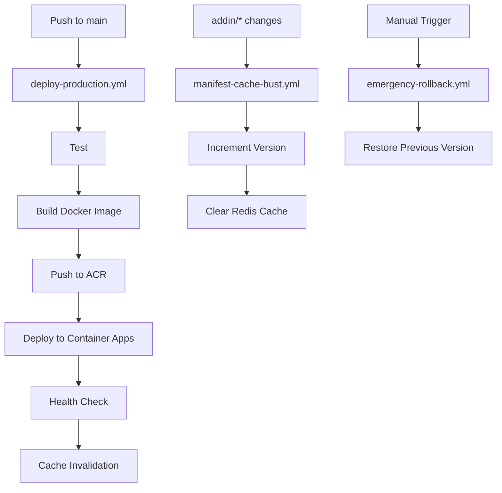

# GitHub Actions Setup Guide

## ⚠️ Required GitHub Secrets

The GitHub Actions workflows are failing because the following secrets need to be configured in your repository settings. Go to **Settings → Secrets and variables → Actions** and add these secrets:

### 🔐 Azure Authentication Secrets

| Secret Name | Description | Where to Find |
|------------|-------------|---------------|
| `AZURE_CLIENT_ID` | Azure Service Principal App ID | Azure Portal → App registrations |
| `AZURE_CLIENT_SECRET` | Service Principal Client Secret | Azure Portal → App registrations → Certificates & secrets |
| `AZURE_TENANT_ID` | Azure AD Tenant ID | Azure Portal → Azure Active Directory → Properties |
| `AZURE_SUBSCRIPTION_ID` | Azure Subscription ID | Azure Portal → Subscriptions |

### 🐳 Azure Container Registry Secrets

| Secret Name | Description | Where to Find |
|------------|-------------|---------------|
| `ACR_USERNAME` | ACR Admin Username | Azure Portal → Container Registry → Access keys |
| `ACR_PASSWORD` | ACR Admin Password | Azure Portal → Container Registry → Access keys |

### 🔑 API Keys

| Secret Name | Description | Current Value (from .env.local) |
|------------|-------------|----------------------------------|
| `API_KEY` | API authentication key | `e49d2dbcfa4547f5bdc371c5c06aae2afd06914e16e680a7f31c5fc5384ba384` |
| `OPENAI_API_KEY` | OpenAI API key | Get from OpenAI dashboard |
| `DATABASE_URL` | PostgreSQL connection string | See .env.local |

## 📝 How to Add Secrets to GitHub

1. Go to your repository: https://github.com/romiteld/ZohoDealCreation
2. Click on **Settings** tab
3. In the left sidebar, click **Secrets and variables** → **Actions**
4. Click **New repository secret**
5. Add each secret with its name and value
6. Click **Add secret**

## 🔧 Getting Azure Service Principal Credentials

If you don't have a service principal yet, create one:

```bash
# Create service principal and get credentials
az ad sp create-for-rbac \
  --name "github-actions-well-intake" \
  --role contributor \
  --scopes /subscriptions/{subscription-id}/resourceGroups/TheWell-Infra-East \
  --sdk-auth
```

This will output JSON with all the required values:
```json
{
  "clientId": "YOUR_CLIENT_ID",
  "clientSecret": "YOUR_CLIENT_SECRET",
  "subscriptionId": "YOUR_SUBSCRIPTION_ID",
  "tenantId": "YOUR_TENANT_ID",
  "activeDirectoryEndpointUrl": "...",
  "resourceManagerEndpointUrl": "...",
  "activeDirectoryGraphResourceId": "...",
  "sqlManagementEndpointUrl": "...",
  "galleryEndpointUrl": "...",
  "managementEndpointUrl": "..."
}
```

## 🏗️ Workflow Files Overview

| Workflow | Purpose | Trigger | Required Secrets |
|----------|---------|---------|------------------|
| `deploy-production.yml` | Full CI/CD deployment | Push to main | All secrets |
| `deploy-simple.yml` | Quick deployment | Manual | Azure + ACR |
| `manifest-cache-bust.yml` | Update manifest version | Push to addin/* | Azure + API_KEY |
| `emergency-rollback.yml` | Rollback deployment | Manual | Azure + ACR |

## ✅ Verification Steps

After adding all secrets:

1. **Test a manual workflow run:**
   ```bash
   # Go to Actions tab → deploy-simple → Run workflow
   ```

2. **Check workflow logs:**
   - Click on the failed workflow run
   - Check which step is failing
   - Verify the secret name matches exactly

3. **Common issues:**
   - Secret names are case-sensitive
   - Expired service principal credentials
   - Insufficient permissions for service principal
   - ACR admin account not enabled

## 🔍 Checking Current ACR Configuration

```bash
# Check if ACR admin is enabled
az acr show --name wellintakeacr0903 --query adminUserEnabled

# Enable admin user if needed
az acr update --name wellintakeacr0903 --admin-enabled true

# Get ACR credentials
az acr credential show --name wellintakeacr0903
```

## 📊 Workflow Dependencies



## 🚨 If Workflows Still Fail

1. **Check the error message in GitHub Actions logs**
2. **Verify Azure resources exist:**
   ```bash
   az containerapp show --name well-intake-api --resource-group TheWell-Infra-East
   az acr show --name wellintakeacr0903
   ```

3. **Test Azure login locally:**
   ```bash
   az login --service-principal \
     -u YOUR_CLIENT_ID \
     -p YOUR_CLIENT_SECRET \
     --tenant YOUR_TENANT_ID
   ```

4. **Contact repository admin** if you don't have access to add secrets

## 📧 Support

If you need the actual secret values or have issues:
- Check `.env.local` for most values
- Azure Portal for Azure-specific credentials
- Contact the repository owner for sensitive credentials

---

*Last Updated: September 2025*