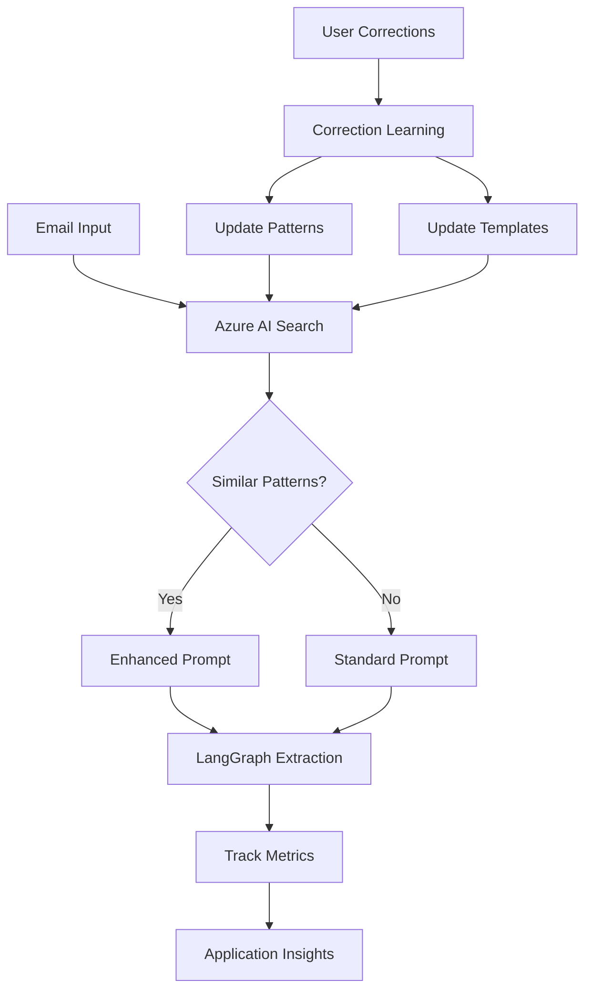

# Learning System Enhancement Guide

## Overview
The Well Intake API now features an advanced learning system powered by Azure AI Search for semantic pattern matching, continuous improvement through user corrections, and A/B testing of prompt variations.

## Components Created

### 1. Azure AI Search Manager (`app/azure_ai_search_manager.py`)
- **Purpose**: Provides semantic search capabilities for pattern matching and learning
- **Key Features**:
  - Semantic search for similar email patterns
  - Company-specific template management
  - Pattern indexing with vector embeddings
  - Learning insights and analytics

### 2. Enhanced Correction Learning (`app/correction_learning.py`)
- **Purpose**: Stores and learns from user corrections
- **Key Features**:
  - Azure AI Search integration for semantic pattern matching
  - Historical correction tracking
  - Prompt enhancement with learned patterns
  - Company template building

### 3. Learning Analytics (`app/learning_analytics.py`)
- **Purpose**: Tracks extraction accuracy and runs A/B tests
- **Key Features**:
  - Field-level accuracy tracking
  - Confidence scoring system
  - A/B testing for prompt variations
  - Application Insights integration
  - Performance metrics and reporting

## Configuration

### Required Environment Variables
Add these to your `.env.local`:

```bash
# Azure AI Search
AZURE_SEARCH_ENDPOINT=https://your-search-service.search.windows.net
AZURE_SEARCH_KEY=your-azure-search-admin-key

# Application Insights (for metrics)
APPLICATIONINSIGHTS_CONNECTION_STRING=InstrumentationKey=your-key;IngestionEndpoint=https://eastus-1.in.applicationinsights.azure.com/
```

## API Endpoints

### Learning Analytics Endpoints

#### Get Field Analytics
```http
GET /learning/analytics/{field_name}?days_back=30&domain=example.com
```
Returns accuracy metrics, confidence scores, and recommendations for a specific extraction field.

#### Get Prompt Variant Report
```http
GET /learning/variants
```
Returns A/B testing results for all prompt variations.

#### Get Learning Insights
```http
GET /learning/insights?domain=example.com&days_back=30
```
Returns overall learning insights from Azure AI Search.

## How It Works

### 1. Pattern Learning Flow
1. When an email is processed, the system searches for similar patterns
2. If corrections are provided, they're indexed in Azure AI Search
3. Company templates are built from recurring patterns
4. Future extractions benefit from historical learnings

### 2. A/B Testing Flow
1. Multiple prompt variants are defined (control, structured, chain-of-thought, confidence-based)
2. System selects variants using epsilon-greedy strategy (10% exploration, 90% exploitation)
3. Performance metrics tracked for each variant
4. Best-performing variants automatically favored over time

### 3. Confidence Scoring
- Each field gets a confidence score based on completeness and format
- Low confidence fields are flagged for review
- Confidence improves as patterns are learned

## Prompt Variants

### Control (Standard)
Basic extraction with explicit rules.

### Structured with Examples
Includes format examples and detailed field descriptions.

### Chain of Thought
Step-by-step reasoning approach for complex extractions.

### Confidence-Based
Includes confidence scoring with each extraction.

## Metrics Tracked

### Extraction Metrics
- Field-level accuracy
- Overall confidence score
- Processing time
- Pattern matches found
- Template usage

### Learning Metrics
- Correction frequency by field
- Common error patterns
- Domain-specific accuracy
- Improvement over time

## Best Practices

### 1. Provide Corrections
Always submit user corrections when available - this trains the system.

### 2. Monitor Analytics
Regularly check field analytics to identify problem areas:
```bash
curl -X GET "https://your-api/learning/analytics/job_title?days_back=30" \
  -H "X-API-Key: your-key"
```

### 3. Review Variant Performance
Check A/B test results weekly to optimize prompts:
```bash
curl -X GET "https://your-api/learning/variants" \
  -H "X-API-Key: your-key"
```

### 4. Build Company Templates
Process multiple emails from the same domain to build accurate templates.

## Architecture



## Performance Improvements

### Expected Improvements
- **Accuracy**: 10-20% improvement after 100+ corrections
- **Speed**: Faster extraction for known patterns (cached)
- **Consistency**: Reduced variation in similar emails
- **Domain-Specific**: 30%+ accuracy boost for frequent domains

### Monitoring
- Application Insights dashboard shows real-time metrics
- Azure AI Search provides pattern match statistics
- Field analytics endpoint shows per-field performance

## Troubleshooting

### Issue: Low Accuracy for Specific Field
**Solution**: Check field analytics and review common errors:
```python
GET /learning/analytics/location?days_back=30
```

### Issue: Slow Pattern Matching
**Solution**: Ensure Azure AI Search indexes are optimized and consider increasing cache TTL.

### Issue: A/B Test Not Converging
**Solution**: Increase epsilon value for more exploration or reduce variant count.

## Future Enhancements

### Planned Features
1. **Auto-Prompt Generation**: ML-generated prompts based on error patterns
2. **Cross-Domain Learning**: Transfer learning between similar companies
3. **Anomaly Detection**: Flag unusual extractions for review
4. **Custom Metrics**: User-defined accuracy metrics
5. **Batch Learning**: Process correction batches for faster improvement

### Integration Opportunities
1. **Power BI**: Real-time learning dashboards
2. **Azure ML**: Advanced pattern recognition
3. **Cognitive Services**: Additional AI capabilities
4. **Teams Integration**: Correction review workflows

## Maintenance

### Daily Tasks
- Monitor Application Insights for errors
- Review confidence scores for trending down

### Weekly Tasks
- Analyze A/B test results
- Review field accuracy reports
- Optimize underperforming prompts

### Monthly Tasks
- Clean up old patterns (>90 days)
- Archive successful templates
- Generate learning report

## Security Considerations

### Data Privacy
- Email content is hashed before indexing
- PII is not stored in search indexes
- Corrections are anonymized

### Access Control
- Azure AI Search uses admin keys
- Application Insights has role-based access
- API endpoints require authentication

## Cost Optimization

### Azure AI Search
- Use S1 tier for production (50k patterns)
- Enable auto-pause for dev environments
- Monitor query usage

### Application Insights
- Use sampling for high-volume metrics
- Set retention to 30 days
- Archive to blob storage if needed

## Support

For issues or questions:
1. Check Application Insights for errors
2. Review Azure AI Search query logs
3. Examine field analytics for patterns
4. Contact: daniel.romitelli@emailthewell.com