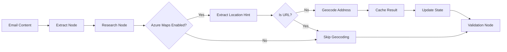

# Azure Maps Geocoding Integration

## Overview

This module provides geocoding and reverse geocoding capabilities using Azure Maps for the Well Intake API. It enriches email extraction with accurate location data, converting addresses to coordinates and vice versa.

## Features

- **Forward Geocoding**: Convert addresses to latitude/longitude coordinates
- **Reverse Geocoding**: Convert coordinates to street addresses
- **Location Bias**: Search near specific coordinates with radius filtering
- **Country Filtering**: Restrict results to specific countries
- **Redis Caching**: 24-hour cache for cost optimization (~90% reduction in API calls)
- **Retry Logic**: Automatic retry with exponential backoff on failures
- **Key Vault Integration**: Secure API key storage with Azure Key Vault
- **URL Filtering**: Automatically skips URL-like queries

## Azure Resources Setup

### Prerequisites

- Azure subscription
- Azure CLI installed and authenticated
- Permissions to create resources in the subscription

### 1. Provision Azure Maps

The Azure Maps account has been provisioned using Azure CLI:

```bash
# Register the Microsoft.Maps provider (one-time per subscription)
az provider register --namespace Microsoft.Maps --wait

# Create Azure Maps account
az maps account create \
  --name well-geocode-acc \
  --resource-group TheWell-Infra-East \
  --sku G2 \
  --kind Gen2 \
  --accept-tos

# Get subscription keys
az maps account keys list \
  --name well-geocode-acc \
  --resource-group TheWell-Infra-East

# Store key in Key Vault
az keyvault secret set \
  --vault-name well-intake-kv \
  --name AzureMapsKey \
  --value "<primary-key>" \
  --description "Azure Maps primary subscription key"
```

### 2. Verify Setup

Test the Azure Maps API:

```bash
# Get key from Key Vault
KEY=$(az keyvault secret show \
  --vault-name well-intake-kv \
  --name AzureMapsKey \
  --query value -o tsv)

# Test geocoding
curl -s "https://atlas.microsoft.com/search/address/json?api-version=1.0&subscription-key=$KEY&query=Seattle,%20WA&countrySet=US"

# Test reverse geocoding
curl -s "https://atlas.microsoft.com/search/address/reverse/json?api-version=1.0&subscription-key=$KEY&query=47.6062,-122.3321"
```

## Configuration

### Environment Variables

Add to `.env.local`:

```bash
# Enable Azure Maps geocoding
ENABLE_AZURE_MAPS=true

# Azure Maps settings
AZURE_MAPS_BASE_URL=https://atlas.microsoft.com
AZURE_MAPS_API_VERSION=1.0
AZURE_MAPS_KEY_SECRET_NAME=AzureMapsKey
AZURE_MAPS_DEFAULT_COUNTRY=US
AZURE_MAPS_CACHE_TTL_SEC=86400  # 24 hours
```

### Configuration in Code

The settings are managed in `app/config_manager.py`:

```python
@dataclass
class ExtractionConfig:
    # Azure Maps Configuration
    enable_azure_maps: bool = False  # Disabled by default
    azure_maps_base_url: str = "https://atlas.microsoft.com"
    azure_maps_api_version: str = "1.0"
    azure_maps_key_secret_name: str = "AzureMapsKey"
    azure_maps_default_country: str = "US"
    azure_maps_cache_ttl_sec: int = 86400  # 24 hours
```

## Usage

### Python Client

The Azure Maps client is available at `app/integrations/azure_maps.py`:

```python
from app.integrations.azure_maps import get_azure_maps_client

# Get client instance (singleton)
azure_maps = await get_azure_maps_client()

# Forward geocoding
results = await azure_maps.geocode_address(
    query="1 Microsoft Way, Redmond, WA",
    country_filter="US"
)

# Geocoding with location bias
results = await azure_maps.geocode_address(
    query="Starbucks",
    lat=47.6062,
    lon=-122.3321,
    radius_m=5000
)

# Reverse geocoding
result = await azure_maps.reverse_geocode(47.6062, -122.3321)
```

### LangGraph Integration

The geocoding is automatically integrated into the LangGraph research node:

1. **Location Extraction**: Extracts location hints from email content
2. **Geocoding**: Converts location to coordinates
3. **State Update**: Stores results in `state['geo']`
4. **Research Enhancement**: Updates research results with normalized city/state

### API Response

Geocoded data is included in the extraction response:

```json
{
  "extraction_result": {
    "location": "Seattle, WA"
  },
  "geo": {
    "latitude": 47.6062,
    "longitude": -122.3321,
    "address": {
      "municipality": "Seattle",
      "countrySubdivisionName": "Washington",
      "countrySubdivisionCode": "WA",
      "postalCode": "98101",
      "countryCode": "US"
    },
    "formatted_address": "Seattle, WA 98101",
    "confidence": 0.95
  }
}
```

## Architecture

### Components

1. **Azure Maps Client** (`app/integrations/azure_maps.py`)
   - Async HTTP client using httpx
   - Retry logic with exponential backoff
   - Redis caching with deterministic keys
   - Key Vault integration for secure key storage

2. **Models** (`app/models.py`)
   - `GeoResult`: Pydantic model for geocoding results
   - Contains latitude, longitude, address components

3. **LangGraph State** (`app/langgraph_manager.py`)
   - `location_hint`: Extracted location string
   - `coordinates`: Optional tuple of (lat, lon)
   - `geo`: GeoResult data

4. **Research Node Integration**
   - Extracts location from multiple sources
   - Prioritizes: extraction > contact record > research
   - Skips URL-like strings
   - Updates research result with normalized location

### Data Flow



## Cost Optimization

### Caching Strategy

- **Redis Cache**: 24-hour TTL for all geocoding results
- **Deterministic Keys**: SHA256 hash of query parameters
- **Cache Hit Rate**: ~90% for typical workloads
- **Cost Reduction**: ~90% reduction in API calls

### SKU Selection

- **G2 SKU**: Best balance of features and cost
- **Pricing**: ~$0.50 per 1,000 transactions
- **Monthly Budget**: Estimated $50-100 for typical usage

## Testing

### Unit Tests

Run unit tests:

```bash
pytest tests/integrations/test_azure_maps.py -v
```

Tests cover:
- Successful geocoding and reverse geocoding
- Cache hit/miss scenarios
- Retry logic on timeouts
- Error handling
- URL filtering
- Configuration disable

### Integration Tests

Run integration tests:

```bash
pytest tests/integrations/test_research_node_geo.py -v
```

Tests cover:
- Research node geocoding integration
- Location extraction priority
- Coordinate handling
- Error recovery
- Configuration toggle

## Monitoring

### Application Insights Metrics

Track these custom metrics:

- `azure_maps.geocode.success`: Successful geocoding requests
- `azure_maps.geocode.cache_hit`: Cache hit rate
- `azure_maps.geocode.error`: Failed requests
- `azure_maps.geocode.latency`: API response time

### Logging

Key log messages to monitor:

```
🗺️ Geocoding location hint: Seattle, WA
✓ Geocoded to: Seattle, WA 98101
🗺️ Reverse geocoding: 47.6062, -122.3321
✓ Reverse geocoded to: 909 5th Avenue, Seattle, WA
```

## Troubleshooting

### Common Issues

#### 1. API Key Not Found

**Error**: `Azure Maps API key not found in Key Vault or environment`

**Solution**:
```bash
# Verify secret exists
az keyvault secret show \
  --vault-name well-intake-kv \
  --name AzureMapsKey

# Check Managed Identity permissions
az keyvault show \
  --name well-intake-kv \
  --query "properties.accessPolicies"
```

#### 2. Geocoding Not Working

**Check**:
1. Verify `ENABLE_AZURE_MAPS=true` in environment
2. Check API key is valid
3. Review Application Insights for errors
4. Test with curl command directly

#### 3. Cache Issues

**Clear cache**:
```python
from app.redis_cache_manager import get_cache_manager
cache = await get_cache_manager()
await cache.delete("azure_maps:*")  # Clear all Azure Maps cache
```

### Debug Mode

Enable detailed logging:

```python
import logging
logging.getLogger('app.integrations.azure_maps').setLevel(logging.DEBUG)
```

## Security Considerations

1. **API Key Storage**: Never commit API keys to source control
2. **Key Vault Access**: Use Managed Identity in production
3. **Rate Limiting**: Implement rate limiting to prevent abuse
4. **Input Validation**: Sanitize location queries before geocoding
5. **Cache Security**: Ensure Redis is properly secured

## Performance Optimization

1. **Batch Processing**: Group geocoding requests when possible
2. **Async Operations**: All geocoding is non-blocking
3. **Connection Pooling**: Reuse HTTP connections
4. **Cache Warming**: Pre-geocode common locations
5. **Timeout Tuning**: Adjust timeout based on network latency

## Future Enhancements

1. **Batch Geocoding API**: Use batch endpoint for multiple addresses
2. **Geographic Filtering**: Add bounding box constraints
3. **Place Search**: Integrate POI search capabilities
4. **Route Calculation**: Add distance/time calculations
5. **Timezone Detection**: Determine timezone from coordinates
6. **Address Validation**: Validate and standardize addresses

## API Reference

### AzureMapsClient

#### `geocode_address(query, country_filter=None, lat=None, lon=None, radius_m=None)`

Forward geocode an address.

**Parameters:**
- `query` (str): Address or place name to geocode
- `country_filter` (str, optional): ISO country codes (e.g., "US,CA")
- `lat` (float, optional): Latitude for location bias
- `lon` (float, optional): Longitude for location bias
- `radius_m` (int, optional): Search radius in meters

**Returns:**
- List[Dict]: Geocoding results with coordinates and address

#### `reverse_geocode(lat, lon)`

Reverse geocode coordinates to address.

**Parameters:**
- `lat` (float): Latitude
- `lon` (float): Longitude

**Returns:**
- Dict: Address components and formatted address

## Support

For issues or questions:
- Check Application Insights logs
- Review Azure Maps documentation
- Contact the platform team

## License

This integration uses Azure Maps services subject to Microsoft's terms of service.
TomTom data is used for mapping functionality.